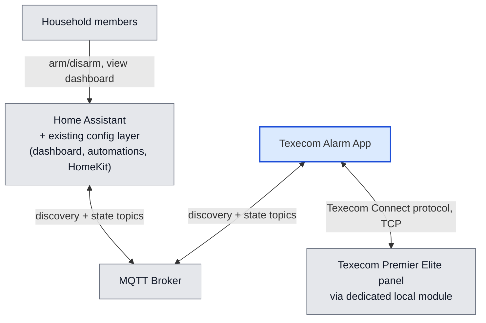
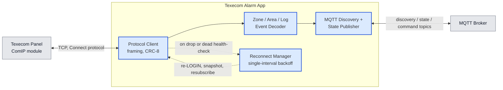
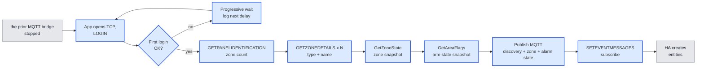
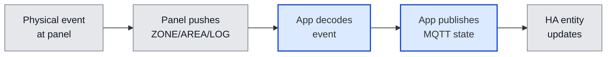
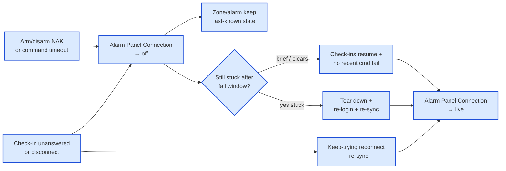
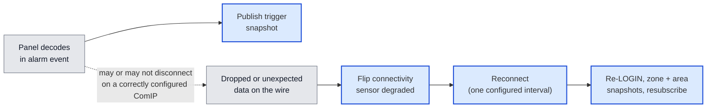

# Architecture

<!-- Synthesised by /architecture on 2026-08-25 from: adr-001-use-dynamic-panel-enumeration-for-zone-discovery.md, adr-003-use-mqtt-discovery-not-native-integration-for-entity-surfacing.md, adr-004-use-app-liveness-unavailability-and-trigger-snapshots-for-panel-link-outages.md, adr-006-use-panel-zone-state-snapshot-for-startup-re-sync.md, adr-008-use-confirmed-shared-arm-disarm-with-away-full-arm-and-home-night-part-arm-mapping.md, adr-009-use-panel-area-flags-snapshot-for-alarm-startup-re-sync.md, adr-011-use-automatic-session-recovery-for-mid-run-panel-path-failures.md, adr-012-use-python-3-for-the-texecom-alarm-app.md, adr-013-use-dedicated-local-network-module-for-home-assistant-panel-access.md, adr-015-use-ready-to-arm-switches-and-mqtt-blocked-arm-event-for-unready-arm-refusal.md, adr-016-use-keepalive-failure-and-command-reject-events-for-panel-connection-detection.md, adr-017-use-a-configurable-5-minute-interval-for-the-panel-reconciliation-poll.md, adr-018-use-interval-only-reconnect-budgets-for-panel-disconnects.md, adr-019-use-a-single-reconnect-interval-and-no-line-noise-defense-for-panel-disconnects.md -->

**Date:** 2026-08-23
**State:** Accepted ✅
<!-- Update 2026-08-21: /architecture Update — fold ADR-013 (dedicated local module) and ADR-014 (host-scoped trigger-disconnect). Synthesis comment lists current Accepted ADRs only (ADR-002 superseded). -->
<!-- Update 2026-08-23: /architecture Update — zone MQTT discovery identity (`spec-zone-monitoring` `_zone_{N}`). -->
<!-- Update 2026-08-23: /architecture Update — fold ADR-015 (ready-to-arm switches and blocked-arm MQTT event). -->
<!-- Update 2026-08-24: /correction — on ready-to-arm refuse, re-publish current alarm MQTT state (same payload) so Home Assistant can drop an optimistic mode tap (`spec-ready-to-arm`). -->
<!-- Update 2026-08-24: /correction — on refuse, MQTT arming then current alarm state (panel untouched); HA ignores a duplicate same-payload publish (`spec-ready-to-arm`). -->
<!-- Update 2026-08-25: /architecture Update — fold ADR-016 (keepalive + command-reject connection detection, superseding ADR-010) and ADR-017 (configurable 5-minute reconciliation poll interval). -->
<!-- Update 2026-08-26: /architecture Update — fold ADR-019 (retires frame-resync and the asymmetric reconnect interval, supersedes ADR-014; dedicated module is now a hard prerequisite with no client-side line-noise defense). -->

## Overview

The household today arms, disarms, and watches its alarm through the prior MQTT bridge. Two
specific behaviours motivate this project: arming to Home mode has never completed
without an add-on crash, and crashes/restarts happen occasionally under other
conditions too — both empirically confirmed against the live panel in this project's
own spikes. Every day, several times a day, the household's automations, dashboard,
and HomeKit bridges all depend on the prior MQTT bridge staying up. The same app is also
intended for other Premier Elite households, published as a public Home Assistant
Add-on with install-time options for facts that differ per panel.

The Texecom Alarm App takes over that role: a self-built Home Assistant App (add-on)
that lives on the same Home Assistant OS host, talks to a **dedicated local network
module** on the panel (not the installer module used for the vendor app and
monitoring station), takes over that module’s Connect login once the prior MQTT bridge is
stopped on the same address, and republishes everything Home Assistant already
consumes — zone state and alarm state — over the same MQTT discovery mechanism
the prior MQTT bridge uses today. Nothing on the consuming side (the `house_alarm_panel`
template wrapper, its automations, the Security dashboard, the HomeKit bridges)
needs to change to keep working.

The hard part here isn't scale — this is a handful of TCP messages a second against 40
in-use zones. It's two coordination problems. First, Home Assistant must use a
dedicated local module: the installer’s signalling module seizes its port to report
an alarm, kicks off whoever was logged in, and can put dialer noise on that same
session. Pointing this app at that module looks like “the panel always drops us
when sirens start”; pointing it at a ComIP reserved for local control does not
(ADR-013). The app no longer defends against that dialer noise in code — the
dedicated module is a hard install prerequisite instead, and any unexpected data
on the wire is treated as a fault that triggers an ordinary reconnect, on one
configured wait interval regardless of what caused the disconnect (ADR-019).
Second, each network module only accepts one Connect login at a time, so
the handoff from the prior MQTT bridge on *that* address has to be sequenced; a second
module can hold its own login at the same time.

Building this commits the project to:

- Pointing the add-on’s panel address at a dedicated local network module, not
  the module used for the vendor app and monitoring-station signalling (ADR-013).
  Not every Premier Elite has two modules; operators must identify which IP is
  which. Disarm during a live alarm is expected on that dedicated module.
- Discovering the zone list from the panel itself at every startup, rather than
  hand-maintaining one in configuration.
- After login (and again after a reconnect re-login), reading a full current-state
  snapshot of every zone from the panel and publishing that for in-use zones before
  treating entities as current — live change events then keep them updated, rather
  than waiting for the next physical change or relying on retained MQTT alone.
- After login (and again after a reconnect re-login), reading a current area/arm-state
  snapshot from the panel and publishing that for the alarm entity before treating it
  as current — live area/log change events then keep it updated, rather than assuming
  disarmed or relying on retained MQTT alone.
- Treating any unrecognised byte on the wire as a fault, not something to skip
  past — it ends the session and triggers an ordinary reconnect. Reconnect-on-drop
  stays, using one configured wait interval for every disconnect regardless of
  cause; there is no separate, longer budget for a trigger-adjacent drop anymore
  (ADR-019, supersedes ADR-014).
- Publishing to Home Assistant purely via MQTT discovery. Household *rules* (which
  doors, guests, time of day, what to say) stay in Home Assistant automations.
  This app does publish three ready-to-arm switches and, on refuse, a blocked-arm
  event — a generic choke, not that household's policy (ADR-015).
- Giving each zone a Home Assistant identity that uses the panel's own name **and**
  the word "zone" plus the panel's zone number, so two sensors with the same name
  stay distinct and that number is clearly the panel's zone — not Home Assistant's
  "this name already existed" suffix. The on-screen name stays ordinary Title Case
  panel text (Front Door), without that zone marker glued on. Ids that used only a
  trailing number will be replaced; automations pointing at the old ids need a
  one-time update. There is no silent keep-the-old-id path.
- Issuing arm and disarm with the empirically confirmed shared command mechanism.
  Away always uses the panel's full-arm mode; Home and Night map to Part-Arm slots
  from per-installation configuration (Home / Night / Unused only — Away is never a
  Part-Arm option), rather than hardcoding this household's engineer layout.
- Keeping **Alarm Panel Connection** truthful using only two triggers: missed
  routine check-ins (or an outright disconnect), and a rejected or timed-out
  arm/disarm command — not “zones went quiet” (ADR-016). The panel reconciliation
  poll no longer feeds this signal at all; it keeps running on its own
  configurable interval (default 5 minutes) purely to correct the alarm entity if
  it ever disagrees with the panel's last-known state (ADR-017).
- Healing mid-run panel failures without a manual add-on restart: when the usual
  health check goes unanswered, use the same keep-trying reconnect path as a clean
  drop; when trust stays broken after a short check window, tear down and log in
  again. Do not silently re-fire a failed arm/disarm tap (ADR-011 /
  `spec-panel-session-heal`).

**Diagram colours:** blue = this system (authored components and local storage); grey =
external people and systems.

**Names used below:** Texecom Alarm App.

### In the wider system

The app sits between the physical alarm panel and the household's existing Home
Assistant setup, talking to each over a completely different protocol.

### Components at a glance

This project has a single project-owned peer, **Texecom Alarm App** — there is no
second codebase to map here. Its two external dependencies (the panel and the MQTT
broker) and its internal shape are detailed under `## Components` below.

### When things go wrong

- **Panel unreachable at startup** — the app cannot build any zone/alarm entities
  until panel login succeeds; there is no offline or cached fallback in this
  architecture. While waiting, the process stays up and retries first
  connect/login with progressive waits (5 s → 10 s → 20 s → 30 s, then 30 s
  until success), logging each next wait so operators can tell patience from a
  hang (`spec-startup-login-backoff`). This schedule does not redefine mid-run
  reconnect patience after a session was already healthy (ADR-014).
- **Unexpected byte on the wire** — the app tears down the connection and
  reconnects rather than scanning forward past it; there is no code-level
  tolerance for dialer/modem text anymore (ADR-019). The dialer/modem text seen
  on this household's session came from the installer signalling module (wrong
  panel address), not from the dedicated local module — using the dedicated
  module is now the way this is avoided, not a client-side skip mechanism
  (ADR-013).
- **Connection dropped** — the app reconnects on one configured wait interval and
  flips **Alarm Panel Connection** off for the duration, regardless of what caused
  the drop; a correctly pointed ComIP is not expected to drop at trigger in the
  first place (ADR-013, SPIKE-010). The `alarm_control_panel` and zone entities
  themselves keep reporting their last known state throughout — they are never
  marked unavailable because of this; only the app process itself being down does
  that (ADR-004).
- **Arm/disarm rejected or times out** — flips **Alarm Panel Connection** off
  immediately, even while routine check-ins still succeed (ADR-016). Brief glitches
  may clear on the next successful check-in; if trust stays broken past a bounded
  fail window, the app tears down and logs in again (ADR-011). Zone/alarm entities
  keep last-known state (ADR-004). Failed arm/disarm taps are not auto-retried. A
  reconciliation-poll timeout in isolation — check-ins and commands otherwise
  healthy — does **not** flip this signal (ADR-016).
- **Ready-to-arm switch off** — that arm is not sent to the panel; the alarm
  entity ends as it was; the app publishes MQTT `arming` then that current
  alarm state so Home Assistant can drop an optimistic mode tap (a second
  identical payload is ignored); a blocked-arm MQTT event names the mode
  only. This app does not speak or explain. Disarm still works. Turning the
  switch off while already armed does not disarm (ADR-015, `spec-ready-to-arm`).
- **Health check unanswered mid-run** — treat like a dead session: Connection stays
  off, keep trying the same reconnect path used after a clean panel drop, then
  re-sync zone/alarm state when the panel accepts again — no manual restart
  (ADR-011). Not the same schedule as progressive first-login backoff.
- **MQTT broker unreachable** — out of scope to solve beyond standard client
  reconnect behaviour; this app has the same standing dependency on the broker that
  the prior MQTT bridge does today.

## Components

### Texecom Alarm App

A single long-running process that speaks the Texecom Connect binary protocol to the
alarm panel on one side, and Home Assistant's MQTT discovery protocol on the other. It
owns no other project-owned peers — Home Assistant, the MQTT broker, and the panel are
all externally owned.

**Role:** Bridges the Texecom Premier Elite panel's ComIP/Connect-protocol session to
Home Assistant, taking over the role the prior MQTT bridge plays today.
**Technology:** Python 3 (ADR-012), packaged as a Home Assistant App (Docker image on
`ghcr.io/home-assistant/base`, s6-overlay-supervised process) — the App-not-integration
shape is ADR-003. Framing/CRC/decode and arm/disarm command work were validated
live against the panel in SPIKE-001, SPIKE-002, and SPIKE-005 (production command
mapping is ADR-008). Docker base and s6 supervision are platform packaging, not a
separate language decision (ADR-012).
**Exposes:** Home Assistant MQTT discovery topics and their paired state/command
topics for: one `alarm_control_panel` entity (`alarm_control_panel.texecom_alarm_arm_status`);
one `binary_sensor` entity per in-use zone
(`binary_sensor.texecom_alarm_{slug}_zone_{N}`, `unique_id` `texecom_alarm_zone_{N}` —
`spec-zone-monitoring`); one dedicated connectivity/freshness `binary_sensor` — friendly name
**Alarm Panel Connection** — reporting panel-link health (ADR-004;
`spec-panel-session-heal`); a "last trigger" snapshot attribute (initiating zone,
timestamp) on the alarm entity (ADR-004); three MQTT `switch` entities for
ready-to-arm Away / Home / Night (start on); and one MQTT `event` entity for a
blocked arm that names the mode only (ADR-015, `spec-ready-to-arm`). No HTTP API, no HA config-flow, no
entity-registry presence beyond what HA's own MQTT integration creates from these
discovery payloads (ADR-003). Clean rename of zone and connectivity
`unique_id` / Entity ID is in scope (no backwards-compat soft path).
**Consumes:**
- Texecom Connect protocol over TCP to the panel's **dedicated local network
  module** (ADR-001, ADR-013, ADR-019, ADR-006, ADR-008, ADR-009, ADR-016,
  ADR-011) — not the installer signalling module.
- The household's MQTT broker, as a standing runtime dependency (ADR-003) — the same
  broker the prior MQTT bridge already uses today.
- App configuration (panel host/port, UDL password, MQTT broker settings, the
  Home/Night→Part-Arm slot mapping, and the reconciliation poll interval — default
  5 minutes) via the HA Supervisor's `config.yaml`/`options.json`/`bashio::config`
  mechanism, already scaffolded in this repo (ADR-013 requires panel host to be the
  dedicated local module; ADR-008 requires Home/Night→slot to be install-time
  configuration with Away excluded from Part-Arm options; ADR-017 requires the
  reconciliation poll interval to be configurable; the exact option shape is still
  open — see Open questions).
**Delivery:** Home Assistant App image with s6-supervised Python 3 process (ADR-012
language; ADR-003 App shape).

Key behaviours:

- **Ready-to-arm refuse** (ADR-015, `spec-ready-to-arm`): discover three MQTT
  switches (Away, Home, Night) that start on. Subscribe to their command/state
  topics. Before any arm command to the panel, if the matching switch is off, do
  not send the arm (including when the request arrived on the alarm entity's MQTT
  command topic); do not change the Home Assistant alarm payload's meaning;
  publish MQTT `arming` then that current state on the alarm state topic so
  Home Assistant can drop an optimistic mode tap (duplicate same-payload
  publishes are ignored); publish an MQTT event whose event
  type / payload names the blocked mode and does not include a household reason.
  Disarm never consults the switches. Turning a switch off while already armed
  does not disarm. Successful arm when the matching switch is on is unchanged
  (ADR-008). Do not encode which doors or guests flip the switches — that is HA
  automations. Topic names and exact `event_type` strings are implementation.
- **MQTT discovery identity** (`spec-zone-monitoring` ACs 6–9): zone discovery
  `object_id` / `default_entity_id` is `binary_sensor.texecom_alarm_{slug}_zone_{N}`
  (example: Front Door, panel zone 1 → `binary_sensor.texecom_alarm_front_door_zone_1`).
  `{slug}` is the panel name, lowercased, non-alphanumerics to underscores; empty
  names use `zone`. `{N}` is the 1-based panel zone number. `unique_id` is
  zone-stable `texecom_alarm_zone_{N}` (slug not in `unique_id`, so a later panel
  rename does not fork identity). Discovery `name` is Title Case panel text
  without `_zone_N` (empty name → `Zone {N}`). Two in-use zones with the same
  panel name stay distinct via `_zone_{N}`. Forbidden: `texecom_alarm_{slug}_{N}`
  (trailing `_{N}` looks like Home Assistant's collision suffix) and slug-only
  ids with no `_zone_{N}`. Alarm identity stays
  `alarm_control_panel.texecom_alarm_arm_status`. Zone **state** topics stay
  `{prefix}/zone/{N}/state` — this contract is discovery identity only. Changing
  `unique_id` orphans previous entities (same no-soft-path rule as the
  connectivity rename); household automations on the old ids need a one-time
  retarget. FakePanel/unit tests must assert `default_entity_id` and `unique_id`
  shape.
- **Startup / first-login progressive backoff** (`spec-startup-login-backoff`, on
  `spec-continuous-operation`): until the first successful panel connect/login
  (including after an add-on restart), failed attempts do not exit the process.
  After the *k*-th failure (`k = 1, 2, 3, …`), wait
  `min(5 × 2^(k-1), 30)` seconds before the next try — **5 s → 10 s → 20 s →
  30 s**, then **30 s** forever until success. Cap is **30 seconds**; never wait
  longer; never give up. Recovery logs must name the wait that will be used
  before the next try. Distinct from ADR-014 reconnect-after-drop after a
  previously healthy session. FakePanel must exercise fail-then-succeed and
  capped-wait shapes for CI.
- **Startup / zone discovery** (ADR-001): after the first successful connect/login
  (including the ≥500ms post-connect wait and UDL password login — panels often
  still use factory default `1234` on unaltered installs; empty UDL is rejected), sends `GETPANELIDENTIFICATION` for
  the zone count, then loops `GETZONEDETAILS` across every zone number and discards
  any slot the panel reports as `zoneType=0` (unused) rather than creating an entity
  for it.
- **Startup / reconnect zone-state snapshot** (ADR-006): after LOGIN (and again after
  a reconnect re-LOGIN), sends `GetZoneState` (cmd `2`) with body
  `[startZone][zoneCount]` (1-byte `startZone` when panel zone count ≤ 256; batches of
  up to 168 zones per request) and receives one status byte per requested zone. Low
  two bits decode as Secure / Active / Tamper / Short — the same map used for
  unsolicited ZONE push events. Publishes MQTT state for in-use zones from that
  snapshot before treating entities as current. Not a substitute for push updates;
  FakePanel (or equivalent) must speak the same read for CI.
- **Startup / reconnect area-flags snapshot** (ADR-009): after LOGIN (and again after
  a reconnect re-LOGIN), sends `GetAreaFlags` (cmd `11`) with body `[start][count]`
  (one household's Elite 88 evidence: `start=0`, `count=72`, `area_size=1` derived from zone count 88) and
  receives `count * area_size` flag bytes. Per-area bits decode with priority
  Alarm(0) → InAlarm; else Armed(21)/FullArmed(22)/PartArmed(23)/ForceArmed(26) →
  Armed or PartArmed (+ PartArm1/2/3 slot); else Disarmed — the same meaning used
  when interpreting live AREA events for settled states. Publishes MQTT alarm state
  for in-use areas from that snapshot before treating the alarm entity as current.
  Part-Arm slot → HA Home/Night remains install-time config (ADR-008); Away is full
  arm, not a Part-Arm label — not auto-detected from the snapshot. Not a substitute
  for push updates; FakePanel (or equivalent) must speak the same read for CI.
  Exit/entry (`arming`/`pending`) may still depend on live AREA pushes until
  corroborated in the flag block.
- **Event subscription and steady-state decode**: sends `SETEVENTMESSAGES` to
  subscribe to `ZONE`/`AREA`/`OUTPUT`/`USER`/`LOG` push messages, then decodes each
  unsolicited message into the corresponding zone/alarm state and publishes it as an
  MQTT state update. Zone/arm *entity* currency in steady state is still push-driven
  (ADR-006 / ADR-009 snapshots remain startup / reconnect only). Separately, the
  panel reconciliation poll (ADR-017) re-reads area-flags on its own configurable
  interval (default 5 minutes) purely to correct the alarm entity if it disagrees
  with the panel — not a replacement for push updates and not part of connectivity
  detection (ADR-016).
- **Idle keepalive and ordinary collision recovery**: sends a safe read-only command
  (e.g. `GETDATETIME`) periodically; on a 2–3s timeout, resends with the same sequence
  number, matching the panel's own documented and empirically-confirmed recovery
  behaviour (ADR-014). Missed check-ins here are one of the two direct triggers for
  marking **Alarm Panel Connection** degraded (ADR-016); keepalive success alone does
  not prove a command will be honoured, which is why command-reject/timeout is the
  other trigger.
- **Panel-connection detection** (ADR-016, supersedes ADR-010): **Alarm Panel
  Connection** goes degraded only on (a) missed routine check-ins or an outright
  disconnect, or (b) an arm/disarm command that is rejected or times out — even
  while check-ins still succeed. It recovers automatically once check-ins resume
  and no recent command failure remains, without a manual add-on restart. The panel
  reconciliation poll (ADR-017) does **not** feed this signal at all — a poll
  timeout in isolation, with check-ins and commands otherwise healthy, must not
  degrade it. FakePanel must exercise the SPIKE-011 detector shapes for CI,
  including that isolated-poll-timeout non-degrade case.
- **Mid-run session heal** (ADR-011 / `spec-panel-session-heal`): unanswered mid-run
  health-check (e.g. keepalive timeout) must **not** abort the listen loop — enter the
  same keep-trying reconnect path as a clean panel drop (Connection off while
  recovering; re-LOGIN + ADR-006/ADR-009 snapshots + resubscribe when the panel
  accepts). Soft trust-degrade: corroborate first; if still stuck after a bounded fail
  window (exact length at `/plan` / live tuning), tear down and log in again. Do not
  auto-retry the failed arm/disarm command. FakePanel must cover health-check →
  reconnect-heal, trust-fail → corroboration recover, and trust-fail → bounded
  re-login.
- **Dedicated local module** (ADR-013): panel host is the dedicated LAN module
  (typically a ComIP reserved for this app), not the installer module used for
  the vendor app and monitoring. This is a hard install prerequisite, not a case
  the app defends against at runtime — reconnect-on-drop is not a licence to
  target the signalling module on purpose. Disarm while triggered is expected
  on the dedicated module. FakePanel must not claim a live alarm always drops the
  login or that Disarm-from-triggered fails.
- **No line-noise defense** (ADR-019, supersedes ADR-014): the wire client no
  longer skips past unexpected/non-frame bytes — any byte that doesn't match the
  expected frame header ends the session and triggers an ordinary reconnect. The
  literal Hayes modem commands (`ATH0`, `ATZ`) seen on this install were the
  installer signalling module multiplexing dialer/reporting traffic onto the
  Connect session; that is not dedicated-ComIP behaviour, and the app no longer
  tolerates it if it occurs.
- **Single-interval reconnect** (ADR-019, supersedes ADR-014): on a dropped
  connection — and, per ADR-011, on an unanswered mid-run health-check —
  reconnects using one configured wait interval and flips **Alarm Panel
  Connection** off throughout — never the `alarm_control_panel`/zone entities
  themselves (ADR-004). The disconnect's cause (an everyday drop vs. one
  following a real trigger) no longer selects a different interval; the app
  always keeps retrying indefinitely either way (ADR-004/ADR-011/ADR-018).
- **Availability and trigger snapshot** (ADR-004): the `alarm_control_panel` and zone
  entities' availability is governed solely by whether the app process itself is
  running (MQTT Last-Will) — never by panel-link health, so a panel-link outage never
  blanks them. A dedicated connectivity `binary_sensor` carries panel-link health
  separately. The app also keeps a short rolling buffer of recent zone/log activity
  and publishes a "last trigger" snapshot (initiating zone, timestamp) the instant it
  decodes a transition into `in alarm`, so the household retains immediate context
  even if the ensuing reconnect takes the full observed window to complete.
- **Cutover dependency** (ADR-001, ADR-013): each network module accepts only one
  Connect login at a time, so the prior MQTT bridge must be fully stopped on the **same**
  address before this app's first connection attempt. A second module (vendor app /
  monitoring) may keep its own login.
- **Arm/disarm command handling** (ADR-008): accepts `arm_away` / `arm_night` /
  `arm_home` / `disarm` on the `alarm_control_panel` MQTT command topic and issues the
  confirmed shared Connect-protocol commands — `cmd=6` with a mode byte for arm, and
  `cmd=8, body=01` for mode-independent disarm (including cancel-during-exit). Away
  always uses the panel full-arm mode byte (`00` on the investigated household), never
  a Part-Arm slot index. Home and Night mode bytes are the Part-Arm slot numbers from
  install-time configuration (Home / Night / Unused only — Away must not appear as a
  Part-Arm option). Home/Night→slot is never hardcoded to this household's layout;
  `GETAREADETAILS` cannot auto-detect Night/Home slot roles and must not be treated as
  a source for that mapping.

## Key flows

### Startup and zone discovery

Runs once per app start, after the operator has stopped the prior MQTT bridge as a one-time
cutover step (the ComIP module will not accept a second client while the prior MQTT bridge
still holds the session).

Until first login succeeds, the app stays running and retries with the progressive
startup backoff above (not the mid-run reconnect budget). Zone slots the panel
reports as unused are dropped during the `GETZONEDETAILS` loop and never reach the
discovery-publish step, so Home Assistant never sees a dead entity for them. The `GetZoneState` snapshot (ADR-006) supplies correct initial open/closed
values for in-use zones on every start (and after reconnect), so zone entities do not
wait for the next physical change or rely on retained MQTT alone. The `GetAreaFlags`
snapshot (ADR-009) supplies correct initial armed/disarmed/part-armed/in-alarm state
for the alarm entity the same way — Part-Arm slot → HA Home/Night still comes from
install-time configuration (ADR-008); Away is full arm, not a Part-Arm label from the
snapshot itself.

### Steady-state zone and alarm reporting

The normal operating loop once discovery has published, for every physical event at
the panel.

Entity state updates in this flow stay push-driven: after the ADR-006 zone and
ADR-009 area-flags startup / reconnect snapshots, ongoing zone/alarm *entity*
changes arrive as unsolicited pushes once `SETEVENTMESSAGES` has been sent
(panel reporting latency observed within the same wall-clock second in
SPIKE-002). Separately, the panel reconciliation poll (ADR-017) re-checks
area-flags on its own configurable interval (default 5 minutes) purely to
correct the alarm entity if it ever drifts from the panel's last-known state —
it is not a substitute for push updates and, since ADR-016, plays no part in
**Alarm Panel Connection**'s degraded/live determination.

### Panel-link trust and mid-run heal

How **Alarm Panel Connection** stays honest using only two triggers (ADR-016), how
mid-run death or stuck trust recovers without a restart (ADR-011), and how
zone/alarm entities keep last-known state throughout (ADR-004). The panel
reconciliation poll (ADR-017) runs independently of this flow — it never
contributes to a degrade or recover decision here.

A rejected or timed-out arm/disarm is an immediate “Connection off” *event* even when
routine check-ins still succeed. A reconciliation-poll timeout in isolation is not a
trigger here at all (ADR-016). Brief glitches may return to live once check-ins
resume and the recent-command-failure window has cleared. If trust stays broken past
the fail window, tear down and log in again. An unanswered mid-run health check
takes the keep-trying reconnect path used after a clean drop — not process exit and
not “wait for a human restart.” Failed arm/disarm taps are never auto-retried as
part of heal. Exact fail-window length and how patient retry cadence lines up with
existing mid-run reconnect budgets stay plan-time / live-tunable (ADR-011); ADR-016
flags that this cadence should be re-checked against the now-narrower set of degrade
triggers, not that it has been re-tuned already.

### Reconnect after disconnect

The app no longer defends against protocol collisions in code (ADR-019, supersedes
ADR-014). On this household, the crash mechanism that looked like "the panel always
multiplexes dialer noise at arm/trigger" was the installer signalling module, not the
dedicated local module — a correctly pointed ComIP stayed up through a live alarm.
The dedicated module is now a hard install prerequisite; any unexpected data on the
wire ends the session rather than being skipped, and reconnect uses one configured
wait interval regardless of what caused the disconnect.

On the dedicated ComIP, most alarms never reach a forced-disconnect branch at all.
Earlier "real trigger always force-disconnects" findings were the signalling-module
path (ADR-014, superseded). If a disconnect does happen — for any reason, not only a
trigger — Resume re-runs login, the zone-state snapshot, the area-flags snapshot, and
event subscribe before live reporting continues, always retrying indefinitely
(ADR-004/ADR-011/ADR-018). The alarm entity itself is unaffected by this whole flow —
it keeps reporting last-known state (including triggered) throughout; only the
dedicated connectivity sensor reflects the degraded/recovering link (ADR-004).

### Arm/disarm command

Arm and disarm arrive on this app's MQTT command topic from Home Assistant (and
anything that talks to that alarm entity). Disarm is always forwarded. For an
arm, the app first reads the matching ready-to-arm switch (ADR-015). If that
switch is off, the app does not talk to the panel, leaves the alarm in the state
it already was, publishes MQTT `arming` then that current alarm state, and
publishes a blocked-arm MQTT event naming the mode — not why. Home Assistant
automations own the "why" (open door, guests) and any spoken
message. If the switch is on, the app maps Away to full arm and Home/Night
through install-time Part-Arm slots, then issues the confirmed Connect command
(ADR-008).

Away, Night, Home, and Disarm are all implementable from SPIKE-005 / ADR-008. Away is
always the full-arm mode byte; the only install-specific input is which Part-Arm slot
is Home vs Night (Unused allowed) — documented add-on options, not code. Away must not
appear on that Part-Arm option surface. Ready switches start on, so a new install
arms as today until someone turns one off. Turning a switch off while already
armed does not disarm.

## Outside systems & tests

| Outside system | In CI | What CI may claim | Live-only |
|---|---|---|---|
| Texecom panel (ComIP) | Stand-in: FakePanel | Login, zone enumerate, zone-state and area-flags snapshots, arm/disarm mode-byte selection (Away = full arm; Home/Night = configured slots), reconnect-when-TCP-dies with no resync/skip path — an unexpected byte sequence ends the session and triggers reconnect, on one configured interval regardless of disconnect cause (ADR-019); keepalive-failure and command-reject connection detection, including that an isolated reconciliation-poll timeout does **not** degrade connectivity (ADR-016 / SPIKE-011); reconciliation poll fires on its configured interval (default 5 minutes) without affecting the connection signal (ADR-017); mid-run health-check → reconnect-heal and trust-fail → corroboration / bounded re-login (ADR-011); progressive startup-login backoff (fail-N-then-succeed waits strictly increasing then capped at 30 s; recovery without process exit); ready-to-arm refuse — matching switch off means no arm command, Home Assistant alarm payload ends unchanged, MQTT `arming` then that current payload (including the Home Assistant command path); disarm still works; switch-off while armed does not disarm (ADR-015, `spec-ready-to-arm`) | Real Away/Night/Home arm sequences; which module `panel_host` is (ADR-013); survive-trigger and HA Disarm-during-alarm on dedicated ComIP (SPIKE-010 / ADR-013 — live-only; FakePanel must not claim the opposite); live quiet-house / command-rejection zombie corroboration under the simplified detector (ADR-016); mid-run heal under real ComIP contention; whether the reconciliation poll's cadence measurably affects audible panel pips (ADR-017 — unconfirmed); live Supervisor timing (RISK-015) |
| MQTT broker | Hermetic / test broker (or FakePanel + recording MQTT client) | Discovery payloads, state/command publish/subscribe, connectivity sensor and last-trigger snapshot attributes; three ready-to-arm switches that start on; blocked-arm MQTT event with mode and without reason (ADR-015) | Household HA entity behaviour; that a real Home Assistant shows the ready switches and can automate on the blocked-arm event (ADR-015); HomeKit/iOS still offering an arm button when a switch is off |

CI never targets the live household panel or a production broker account. Product
validation of live behaviour belongs at `/accept` (optional go-live smoke at `/ship`).

## Security, operations, scope, and open questions

**Security:** Panel login uses the installer's UDL password (panels often still use
the factory default `1234` on unaltered installs — RISK-009; SPIKE-001 confirmed
LOGIN requires a non-empty UDL). The panel is reachable solely over the household
LAN — an inherited, pre-existing condition, not something this app changes. MQTT
broker credentials are supplied via the same HA Supervisor config mechanism as the
panel's; no new external network exposure is introduced.

**Logging and monitoring:** Standard `bashio::log` output via the s6-supervised
process, plus a dedicated connectivity/freshness `binary_sensor` (**Alarm Panel
Connection**) published over MQTT that reflects off/recovering panel-link health
during recovery windows (ADR-019, ADR-004), keepalive-failure / command-reject
detection (ADR-016), and mid-run session heal (ADR-011) — the `alarm_control_panel`/zone
entities themselves are not used for this signal, since their own last-known state
must stay visible throughout (ADR-004). Everyday logs must make recovery attempts and
failures obvious (not TRACE-only). Startup first-login failures must log the wait
duration before the next try (`spec-startup-login-backoff`) so operators can
distinguish backoff from a hang.

**Deployment:** Ships as a Home Assistant App (add-on) using the existing
`config.yaml`/`Dockerfile`/`rootfs` scaffold (arch: `aarch64`, `amd64`), run as a
single s6-supervised process that restarts automatically on a non-zero exit. Cutover
from the prior MQTT bridge is a hard sequencing step **on the dedicated local module**, not
a side-by-side rollout on that same IP: the prior MQTT bridge must be stopped before this
app's first connection attempt (ADR-001). The installer signalling module may stay
up for the vendor app and monitoring (ADR-013).

**Out of scope.**

- Building or changing the Lovelace dashboard or HomeKit exposure — both keep working
  off the same entity names/states this app publishes.
- Encoding household arming *rules* or spoken/notify wording in this app (which
  doors, guests, time of day). Those stay in Home Assistant automations that
  flip the ready-to-arm switches and listen for the blocked-arm event. The
  generic refuse (switches + event) *does* live in this app (ADR-003, ADR-015).
- Support for the older UDL/Wintex serial protocol, or panel families other than
  Premier Elite.
- A guided config-flow/setup-wizard UI, HACS packaging, or a natively-registered
  `custom_components` integration — distribution is a public Add-on repository with
  documented options (ADR-003; brief non-goals).

**Open questions.**

- **Exact reconnect wait interval is not finalised.** There is now a single
  configured interval for every disconnect, not separate ordinary/trigger budgets
  (ADR-019, supersedes ADR-014's asymmetric split). ADR-011 heal cadence may align
  with it; do not treat that alignment as newly finalised by heal alone.
- **What "alarm reset" means as a product-observable signal is unresolved**
  (still open from the superseded reconnect ADR) — no distinct Connect-protocol
  event was observed for clearing the alarm-memory indicator. This architecture
  assumes the area event returning to armed/disarmed is the practical signal —
  needs confirmation before building a dedicated reset signal.
- **Whether the ComIP module's one-connection-at-a-time behaviour is a fixed
  hardware/firmware limit or a configurable installer setting** was not tested — cutover
  still assumes a hard stop of the prior MQTT bridge before this app connects (ADR-001).
  Two *different* module IPs can each hold a login (ADR-013).
- **Whether to add a last-known-good cached zone list fallback** when the panel can't be
  reached at startup (ADR-001 Option C) remains an open follow-on — no offline fallback
  in this architecture.
- **How exit/entry (arming/pending) appear in the area-flags snapshot** versus only on
  live AREA pushes was not observed in SPIKE-007 (ADR-009). Use live AREA pushes for
  those transients until corroborated.
- **Concrete shape of the Part-Arm mapping add-on options** (ADR-008) — e.g. three
  fields vs one ordered list — settles at `/plan` / build; Away must stay excluded.
- **Com Port / reporting isolation** (RISK-011) — the app no longer carries any
  client-side collision/noise defense (ADR-019); using the dedicated local module
  is the sole mitigation now, not an optional secondary alongside app resilience.
  SPIKE-010 showed a live ARC report concurrent with a dedicated-ComIP session that
  did not drop; do not assume a trigger always force-disconnects ComIP.
- **ResetArea (cmd 9) before disarm-in-alarm** — SPIKE-009 failed on the SmartCom
  because the session had already dropped. SPIKE-010 on the ComIP disarmed a live
  alarm with ordinary disarm (cmd 8). Do not wire cmd 9 unless a ComIP run shows it
  is actually required.

## Review

| # | Date | Verdict | Issues |
|---|------|---------|--------|
| 1 | 2026-08-03 | Issues found | 1 |
| 2 | 2026-08-03 | Clear | — |
| 3 | 2026-08-04 | Clear | — |
| 4 | 2026-08-04 | Issues found | 1 |
| 5 | 2026-08-04 | Clear | — |
| 6 | 2026-08-04 | Clear | — |
| 7 | 2026-08-08 | Clear | — |
| 8 | 2026-08-09 | Issues found | 1 |
| 9 | 2026-08-09 | Clear | — (review-8 Key flows ADR-010 contradiction fixed) |
| 10 | 2026-08-09 | Clear | — |
| 11 | 2026-08-09 | Clear | — |
| 12 | 2026-08-10 | Issues found | 1 |
| 13 | 2026-08-10 | Clear | — (review-12 Python technology gap cleared via ADR-012) |
| 14 | 2026-08-21 | Clear | — |
| 15 | 2026-08-23 | Clear | — |
| 16 | 2026-08-23 | Clear | — |
| 17 | 2026-08-24 | Clear | — |
| 18 | 2026-08-24 | Clear | — |
| 19 | 2026-08-25 | Clear | — |
