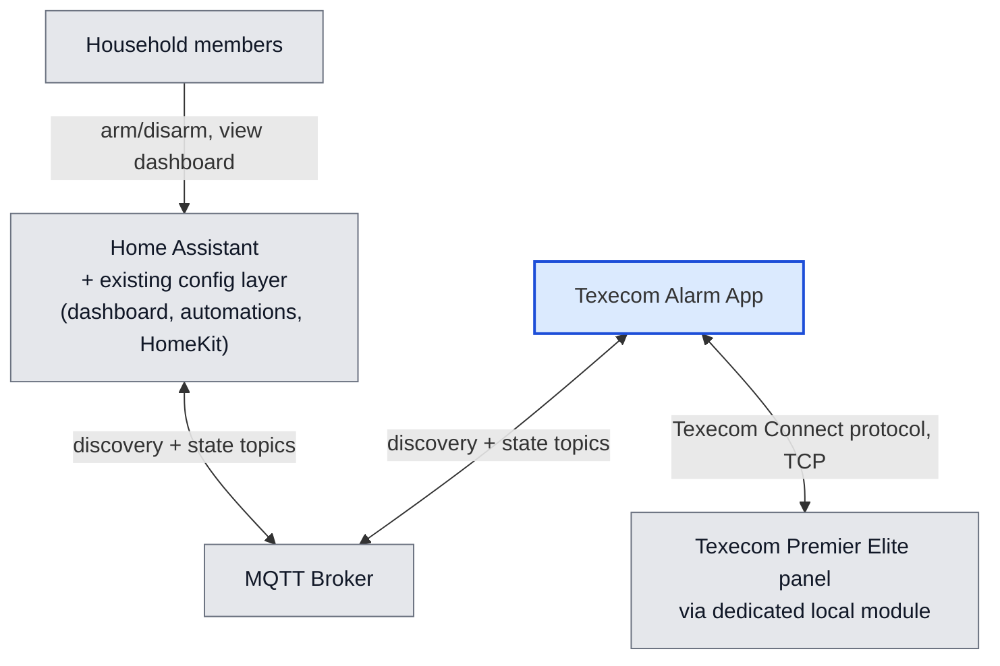
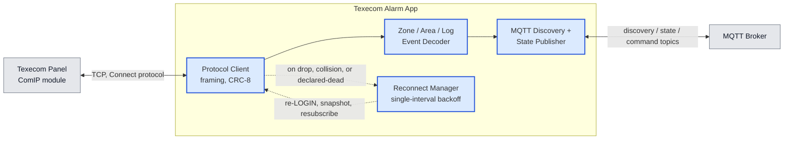
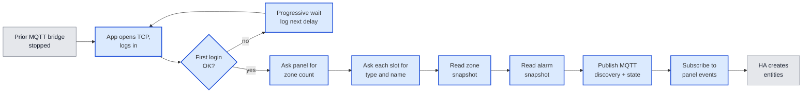
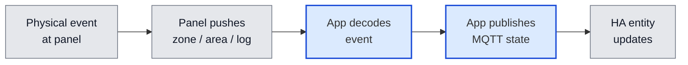
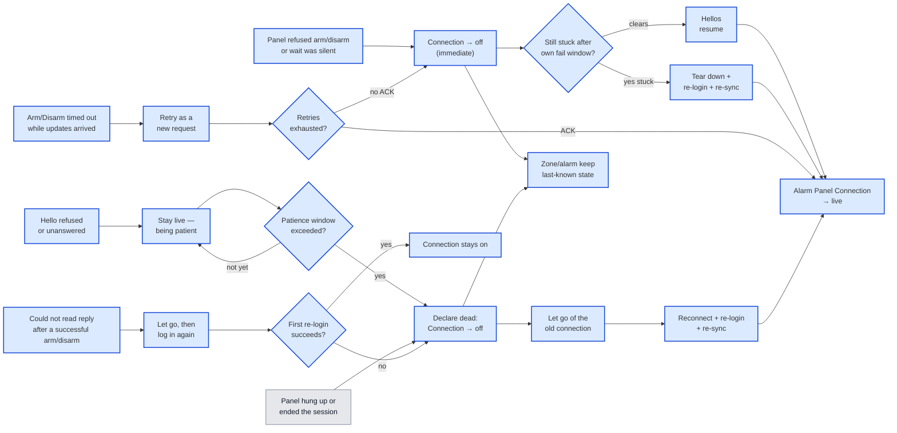
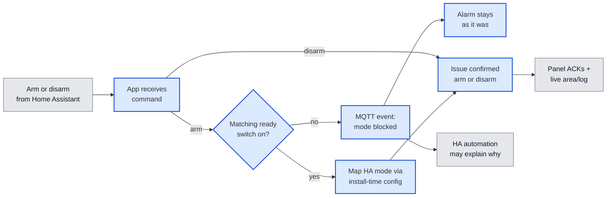

# Architecture

<!-- Synthesised by /architecture on 2026-09-03 from: adr-001-use-dynamic-panel-enumeration-for-zone-discovery.md, adr-003-use-mqtt-discovery-not-native-integration-for-entity-surfacing.md, adr-004-use-app-liveness-unavailability-and-trigger-snapshots-for-panel-link-outages.md, adr-006-use-panel-zone-state-snapshot-for-startup-re-sync.md, adr-008-use-confirmed-shared-arm-disarm-with-away-full-arm-and-home-night-part-arm-mapping.md, adr-009-use-panel-area-flags-snapshot-for-alarm-startup-re-sync.md, adr-012-use-python-3-for-the-texecom-alarm-app.md, adr-013-use-dedicated-local-network-module-for-home-assistant-panel-access.md, adr-015-use-ready-to-arm-switches-and-mqtt-blocked-arm-event-for-unready-arm-refusal.md, adr-017-use-a-configurable-5-minute-interval-for-the-panel-reconciliation-poll.md, adr-022-use-one-busy-versus-dead-session-model-including-late-command-replies-for-panel-connection-health.md, adr-023-use-ordinary-home-assistant-disarm-without-a-separate-reset-for-a-sounding-alarm.md -->

**Date:** 2026-09-03
**State:** Accepted ✅

## Overview

You already arm, disarm, and watch the house from Home Assistant. This project replaces the old MQTT bridge with a Home Assistant add-on that talks to a Texecom Premier Elite and publishes the same kind of entities you already use: door/window/PIR sensors, an alarm control panel, and a sensor that says whether we can still talk to the panel.

Two things made the old bridge painful: arming to **Home** would crash the add-on, and the add-on would also drop out at other times. Dashboards, automations, and HomeKit all depend on it staying up. The same add-on is meant for other Premier Elite households, with install options for the facts that differ per panel (which network box, which Part-Arm slot is Home vs Night, how often to poll).

Nothing on the Home Assistant side has to be rewritten to keep working. Your existing alarm card, automations, and HomeKit bridges keep talking to MQTT-discovered entities, same as today.

Traffic is small — a handful of messages a second. The difficulty is using the panel without fighting other clients.

The panel can have two network boxes. One is for local control on your LAN — that is where this add-on must point. The other is the installer box used by the phone app and the monitoring station. That installer box will kick whoever is logged in off when it reports an alarm, and can dump modem chatter onto the line. Pointing Home Assistant at that box looks like “the panel always drops us when the sirens start.” Pointing it at a box reserved for local control does not. This add-on does not try to ignore that modem chatter in software; using the right box is an install requirement.

Each box allows only one login at a time. The old MQTT bridge on the same address has to be fully stopped before this add-on connects. A second box (phone app / monitoring) may keep its own login.

When the panel is sending a burst of zone or alarm updates, that is not the same as the link being dead. **Alarm Panel Connection** should mean “we cannot talk to the panel,” not “the panel was briefly busy.” Your alarm and zone entities keep showing the last known state while that happens; they do not go unavailable just because the panel link hiccupped.

Building this commits the project to:

- Point the add-on’s panel address at the dedicated local network box, not the installer box used for the vendor app and monitoring (ADR-013). Not every Premier Elite has two boxes; you must identify which IP is which. Disarm during a live alarm is expected on that dedicated box.
- Ask the panel for its own zone list at every startup, rather than maintaining a zone list in configuration. Unused slots do not become Home Assistant entities (ADR-001).
- After login, and again after a reconnect login, read the current open/closed state of every in-use zone from the panel and publish that before treating sensors as current. Live change events then keep them updated — we do not wait for the next physical change, and we do not rely on retained MQTT alone (ADR-006).
- The same after login for the alarm itself: read whether the panel is armed, part-armed, disarmed, or in alarm, and publish that before treating the alarm entity as current (ADR-009).
- Never skip unexpected bytes hoping to find the next valid message. If the stream is unusable, close it cleanly and log in again. Reconnect uses one wait interval for every disconnect, retries indefinitely, and must let go of the old connection quickly so this add-on cannot sit on the panel’s single slot (ADR-022).
- Publish to Home Assistant purely via MQTT discovery — not a native integration. Household *rules* (which doors, guests, time of day, what to say) stay in your automations. This add-on does publish three ready-to-arm switches and, when it refuses an arm, an event naming the mode — a generic choke, not your household’s policy (ADR-003, ADR-015).
- Give each zone a Home Assistant identity that uses the panel’s own name **and** the word “zone” plus the panel’s zone number, so two sensors with the same name stay distinct and that number is clearly the panel’s zone — not Home Assistant’s “this name already existed” suffix. The on-screen name stays ordinary Title Case (Front Door). Ids that used only a trailing number will be replaced; automations pointing at the old ids need a one-time update. There is no silent keep-the-old-id path.
- Away is always the panel’s full arm. Home and Night map to Part-Arm slots from per-installation configuration (Home / Night / Unused only — Away is never a Part-Arm option), rather than hardcoding one household’s engineer layout (ADR-008).
- **Alarm Panel Connection** goes off only when we cannot talk: the panel hung up, it ended the session, hellos failed for the whole patience window, an arm/disarm was refused, an arm/disarm timed out with **no** updates during that wait, or busy arm/disarm retries (each a new request) are exhausted. It does not go off on a late reply while ordinary updates are still arriving, because a successful command’s follow-up read then misparsed, or because the background reconciliation poll timed out. A busy panel still gets its scheduled hellos; we do not pile extra questions onto a burst whose answer already arrived as a live update — including never asking for a full alarm-flags snapshot after a successful Arm (ADR-017, ADR-022).
- Recover mid-run without a manual add-on restart. Two waits must not be merged: patience for missed hellos, and an immediate Connection-off plus its own countdown after a refused or silent arm/disarm. Retry a chatty timed-out Arm or Disarm as a new request **before** declaring failure; do not silently press again after a tap the household already saw fail. Zone and alarm entities stay visible throughout; only the add-on process itself dying can mark them unavailable (ADR-004, ADR-022).
- Disarm from Home Assistant during a live alarm is a supported path on the dedicated local box. Do not add a separate panel Reset command; leftover keypad alarm memory after a successful Disarm is acceptable (ADR-013, ADR-023).

**Diagram colours:** blue = this add-on; grey = things we did not write (you, Home Assistant, the broker, the panel).

**Names used below:** Texecom Alarm App.

### In the wider system

You tap Arm in Home Assistant. Home Assistant talks to an MQTT broker. This add-on also talks to that broker, and separately talks to the alarm panel on your LAN.

### Components at a glance

We write one piece of software: the **Texecom Alarm App** (this add-on). Home Assistant, the MQTT broker, and the alarm panel already exist.

### When things go wrong

- **The panel is off or unreachable when the add-on starts.** You will not see zone or alarm entities until login succeeds. There is no remembered zone list to fall back on. The add-on stays running and retries, waiting 5 s, then 10 s, then 20 s, then 30 s forever, and logs each next wait so you can tell patience from a hang. That schedule is only for first login — not the same as reconnecting later in the day (`spec-startup-login-backoff`, ADR-022).
- **The panel hung up, or said the session is over.** **Alarm Panel Connection** turns off. Your alarm and zone sensors keep showing whatever they last showed — they do not go unavailable. The add-on lets go of the old connection quickly (so it does not hog the panel’s only slot), waits one configured interval, logs in again, and re-reads zone and alarm state (ADR-004, ADR-022). A correctly pointed local-control box is not expected to drop at trigger in the first place (ADR-013).
- **The panel sent something we could not read, after an arm or disarm that already succeeded.** That is a busy-line collision, not “your arm/disarm failed.” The add-on closes the stream and logs in again. If that first re-login works, **Alarm Panel Connection** stays on. A hang-up or `+++` is still a lost session (Connection off), not that collision — even if the card already shows `arming` or a prior arm already succeeded. The add-on never skips unexpected bytes hoping to find the next message (ADR-022).
- **A second identical Arm arrives after that mode already succeeded (or while the card shows that armed mode, or generic `arming` for this same gesture).** The duplicate is ignored — no second arm command to the panel. Disarm and a different arm mode still go through, including while the card shows generic `arming` (exit does not name the mode). Once the house is Off again (including a keypad or vendor unset), a later same-mode Arm is a new tap and is sent.
- **Reconnect re-reads flags while the card already shows exit or entry (`arming` / `pending`), or while the card is still Off after an arm that already succeeded.** A snapshot that still looks unset must not publish Off over exit/entry, and must not forget that in-flight arm (a later identical Arm is still ignored). Flags omit exit/entry (ADR-009, ADR-022).

- **You tapped Arm or Disarm and the panel said no, or the wait was completely silent.** **Alarm Panel Connection** turns off immediately so you can see the command did not take — even if the panel is still answering routine hellos. The add-on will not press the button again for you. It then uses its own short countdown to log in again if the panel is still refusing. That countdown is not the same as “wait for a few missed hellos”: a panel has been seen answering hellos all day while refusing every arm. A background poll that merely timed out, with hellos and commands otherwise fine, does **not** turn Connection off (ADR-017, ADR-022).
- **You tapped Arm or Disarm and the wait timed out while ordinary updates were still arriving.** The panel is busy, not gone. **Alarm Panel Connection** stays on. The add-on retries the same tap as a **new** request. If those retries still get no reply, Connection then goes off and the refused-command countdown runs. Updates in general are not proof the session will accept commands — updates during **this** wait only mean the line is not silent (ADR-022).
- **A routine hello to the panel is refused or ignored.** Nothing visible happens at first. **Alarm Panel Connection** stays on while the add-on is being patient. Only if that keeps happening past a configured patience period (about three missed hellos by default) does the add-on treat the session as dead and recover as if hung up — no manual restart (ADR-022).
- **A ready-to-arm switch is off.** That arm never reaches the panel. The alarm entity stays as it was. Home Assistant may briefly show Arming; this add-on then republishes the current state so Home Assistant can drop an optimistic mode tap. An event names which mode was blocked, not why (open door, guests — that stays in your automations). This add-on does not speak or explain. Disarm always works. Turning a switch off while already armed does not disarm (ADR-015).
- **The MQTT broker is down.** Same standing dependency as today: the add-on reconnects to the broker. Not something this architecture specially solves.

## Components

### Texecom Alarm App

This add-on is one always-on process. On one side it speaks the panel’s binary Connect protocol. On the other it publishes MQTT discovery so Home Assistant creates entities the usual way. Home Assistant, the broker, and the panel are all owned elsewhere.

**Role:** Bridges the Premier Elite’s Connect session to Home Assistant.
**Technology:** Python 3 (ADR-012), packaged as a Home Assistant App (Docker on `ghcr.io/home-assistant/base`, s6-supervised process). App-not-integration is ADR-003.
**Exposes:** MQTT discovery and paired state/command topics for: `alarm_control_panel.texecom_alarm_arm_status`; one `binary_sensor` per in-use zone (`binary_sensor.texecom_alarm_{slug}_zone_{N}`, `unique_id` `texecom_alarm_zone_{N}`); **Alarm Panel Connection** (`binary_sensor`, ADR-004); a last-trigger snapshot attribute on the alarm entity (initiating zone, timestamp); three ready-to-arm switches (Away / Home / Night, start on); one blocked-arm MQTT event that names the mode only (ADR-015). No HTTP API, no HA config-flow. Clean rename of zone and connectivity ids — no backwards-compat soft path.
**Consumes:**
- Texecom Connect over TCP to the **dedicated local network module** (ADR-001, ADR-006, ADR-008, ADR-009, ADR-013, ADR-022, ADR-023).
- The household MQTT broker (ADR-003).
- Supervisor config: panel host/port, UDL password, MQTT settings, Home/Night→Part-Arm slots, reconciliation-poll interval (default 5 minutes), hello cadence, patience period, reconnect wait (ADR-008, ADR-013, ADR-017, ADR-022). Option *shape* is still open — see Open questions.
**Delivery:** Home Assistant App image, s6-supervised Python 3 process (ADR-003, ADR-012).

Key behaviours:

- **Ready-to-arm refuse** (ADR-015, `spec-ready-to-arm`): you get three switches in Home Assistant (Away, Home, Night) that start on, so a new install arms as today until you turn one off. If the matching switch is off, that arm is not sent to the panel — including when Home Assistant itself asked. Publish MQTT `arming` then the current alarm state so Home Assistant can drop an optimistic mode tap (duplicate same-payload publishes are ignored). Publish an event naming the blocked mode, not why. Disarm never consults the switches. Turning a switch off while already armed does not disarm. Which doors or guests flip the switches is Home Assistant automations.
- **MQTT discovery identity** (`spec-zone-monitoring`): zone `default_entity_id` is `binary_sensor.texecom_alarm_{slug}_zone_{N}` (Front Door, panel zone 1 → `binary_sensor.texecom_alarm_front_door_zone_1`). `{slug}` is the panel name, lowercased, non-alphanumerics to underscores (empty → `zone`). `{N}` is the 1-based panel zone number. `unique_id` is zone-stable `texecom_alarm_zone_{N}` (slug not in it, so a later panel rename does not fork identity). Discovery `name` is Title Case panel text without `_zone_N` (empty → `Zone {N}`). Forbidden: `texecom_alarm_{slug}_{N}` (trailing `_{N}` looks like Home Assistant’s collision suffix) and slug-only ids. Alarm identity stays `alarm_control_panel.texecom_alarm_arm_status`. Zone **state** topics stay `{prefix}/zone/{N}/state`. Changing `unique_id` orphans previous entities.
- **Startup first-login backoff** (`spec-startup-login-backoff`): until the first successful panel login (including after an add-on restart), failed attempts do not exit the process. After the *k*-th failure wait `min(5 × 2^(k-1), 30)` seconds — **5 s → 10 s → 20 s → 30 s**, then **30 s** forever. Recovery logs must name the wait that will be used next. Distinct from mid-run reconnect budgets (ADR-022).
- **Zone discovery** (ADR-001): after login (≥500 ms post-connect wait, UDL password — empty UDL rejected; factory `1234` is common), `GETPANELIDENTIFICATION` then `GETZONEDETAILS` per slot; discard `zoneType=0`.
- **Zone-state snapshot** (ADR-006): after LOGIN and after reconnect LOGIN, `GetZoneState` (cmd `2`) `[startZone][zoneCount]` (1-byte start when count ≤ 256; batches of ≤168). One status byte per zone; low two bits Secure / Active / Tamper / Short — same map as live ZONE pushes. Publish in-use zones before treating them as current.
- **Area-flags snapshot** (ADR-009): after LOGIN and after reconnect LOGIN, `GetAreaFlags` (cmd `11`) `[start][count]`. Per-area bits: Alarm(0) → InAlarm; else Armed(21)/FullArmed(22)/PartArmed(23)/ForceArmed(26) → Armed or PartArmed (+ PartArm slot); else Disarmed — same meaning as live AREA for settled states. Part-Arm → Home/Night is install-time config (ADR-008); Away is full arm, not a snapshot label. Exit/entry (`arming`/`pending`) may still need live AREA pushes.
- **Steady-state events and reconciliation poll:** `SETEVENTMESSAGES` for ZONE/AREA/OUTPUT/USER/LOG; decode and publish. Entity currency in steady state is push-driven. The reconciliation poll (ADR-017) re-reads area flags on its own interval (default 5 minutes) to correct drift if the alarm entity ever disagrees with the panel — not a substitute for pushes and not part of Connection (ADR-022).
- **Session health** (ADR-022 / `spec-panel-session-heal`): Connection means we cannot talk. Hellos (`GETDATETIME`) run on a fixed elapsed-time clock, never starved by inbound events and never tied to the reconciliation poll. Unprompted traffic is not proof the session will accept commands. Events **during an Arm/Disarm wait** only mark that wait busy rather than silent. A refused or unanswered hello starts a patience streak (default ~3 missed); only exceeding that window declares the session dead. Hung up or end-of-session (`+++`) is dead immediately. Arm/disarm NAK or **silent** timeout (no well-formed `M` during the wait) turns Connection off immediately and runs its own fail window to a fresh login — never merge that clock with patience. Arm/disarm timeout **while well-formed `M` arrived** does not turn Connection off: retry with a **new sequence** within the existing retry budget; Connection off only if that budget is then exhausted without an ACK. After a successful Arm ACK, never `GetAreaFlags`. After a successful Disarm ACK, `GetAreaFlags` only if live AREA/LOG have not already published unset. A decode miss after an ACK already received is a collision: bounded release, log in again, re-read state; do **not** record it as arm/disarm command failure; Connection stays on if attempt 1 succeeds. Never skip unexpected bytes. On decode fail, log reason and leading hex at shipping log level. Reconnect uses one configured interval, retries indefinitely, and must release the old socket in bounded time (forcibly if it will not close). Login’s own retry budget stays. Do not auto-retry an Arm/Disarm already declared failed; new-sequence retries **before** that declaration are required.
- **Dedicated local module** (ADR-013, ADR-023): hard install prerequisite. Reconnect-on-drop is not a licence to target the signalling module. Disarm while triggered is expected on the dedicated module. Do not add a separate Reset command; leftover keypad alarm memory after Disarm is acceptable.
- **Availability and last trigger** (ADR-004): alarm and zone availability follow MQTT Last-Will (add-on process up or down), never panel-link health. Connection is the freshness signal. On transition into `in alarm`, publish initiating zone and timestamp from a short rolling buffer so you still have context if a reconnect follows.
- **Cutover** (ADR-001, ADR-013): stop the prior MQTT bridge on the **same** address before first connect. A second module may keep its own login.
- **Arm/disarm** (ADR-008, ADR-023): MQTT `arm_away` / `arm_night` / `arm_home` / `disarm` → confirmed Connect commands (`cmd=6` + mode byte; `cmd=8, body=01` for disarm, including cancel-during-exit and Disarm while triggered). Away always full-arm mode byte (`00` on the investigated household). Home/Night are configured Part-Arm slot numbers. `GETAREADETAILS` cannot auto-detect those roles. Do not send ResetArea (`cmd=9`).

## Key flows

### Startup and zone discovery

When the add-on starts, it logs into the panel, asks which zones exist, reads whether each door is open and whether the alarm is set, then creates the matching Home Assistant entities. Unused panel slots never become sensors. Until first login succeeds, the add-on stays running and retries with the progressive wait above — not the mid-run reconnect wait.

This runs after you have stopped the old MQTT bridge on that address (the box will not accept a second client).

The zone snapshot (ADR-006) and area-flags snapshot (ADR-009) supply initial open/closed and armed/disarmed so entities do not wait for the next physical change or rely on retained MQTT. Part-Arm slot → Home/Night still comes from install-time configuration (ADR-008); Away is full arm, not a label from the snapshot.

### Steady-state zone and alarm reporting

Once entities exist, a door opening or the alarm changing is the panel telling this add-on, which publishes MQTT, which updates Home Assistant — usually within the same second.

After the startup snapshots, entity changes are unsolicited pushes (`SETEVENTMESSAGES`). Separately, the reconciliation poll (ADR-017) re-checks area flags every 5 minutes by default to correct the alarm entity if it ever drifts — it is not a substitute for those pushes and does not feed **Alarm Panel Connection**.

### Panel-link trust and mid-run heal

**Alarm Panel Connection** is how you tell “we cannot talk to the panel” from “the panel is busy sending updates.” Your alarm and zone sensors keep their last values either way. The add-on recovers without you restarting it.

Four different situations must not be collapsed into one:

- You armed or disarmed and the panel refused, or the wait was silent — Connection off at once, then a short separate countdown to a fresh login if it stays stuck.
- You armed or disarmed and the wait timed out while ordinary updates were still arriving — Connection stays on; retry as a new request; off only if those retries are exhausted.
- A routine hello was refused — Connection stays on until that has happened for the whole patience window.
- An arm or disarm already succeeded, then a follow-up read did not parse — log in again; Connection stays on if that first re-login works.

Those two countdowns must never share one clock. Merging them would hide a panel that answers hellos while refusing every command. A hung-up connection skips patience and turns Connection off immediately. A chatty Arm/Disarm timeout is busy, not that refuse path — retries use a new request and leave Connection on until the budget is exhausted. Resume always re-runs login, both snapshots, and event subscribe, retrying indefinitely. On a correctly pointed dedicated local box, a live alarm is not expected to force a disconnect; earlier “the sirens always kick us off” findings were the installer box (ADR-013). The add-on lets go of its own connection within a bounded time before reconnecting, so it can never lock itself out of the panel’s single slot. Failed arm/disarm taps are never auto-retried after failure is declared. An isolated reconciliation-poll timeout is not a trigger on either path (ADR-017).

### Arm/disarm command

You tap Away, Home, Night, or Disarm in Home Assistant (or anything that talks to that alarm entity). Disarm always goes to the panel. For an arm, the add-on first looks at the matching ready-to-arm switch. If that switch is off, the panel is not contacted, the alarm stays as it was, Home Assistant gets Arming then the current state (so it can drop an optimistic tap), and an event names the blocked mode — not why. Your automations own the “why” (open door, guests) and any spoken message.

If the switch is on, Away is full arm; Home and Night use the Part-Arm slots you configured. A second identical Arm after that mode already succeeded (or while the card shows that armed mode, or generic `arming` for this same gesture) is ignored so it does not enter the exit event burst. A different arm mode still goes through, including during exit. That ignore is this tap’s race, not “Night ACK’d once this process, never Night again”: if the house is unset (including from the keypad), a later same-mode Arm is sent. After a successful Arm, the add-on never asks again for area flags — live area/log events already carry exit and armed. After Disarm, that extra read runs only if live events have not already published unset. Login and reconnect snapshots still always re-read flags (ADR-009, ADR-022). Disarm while the alarm is sounding is the same Disarm command; there is no separate Reset (ADR-023).

Ready switches start on, so a new install arms as today until someone turns one off. Turning a switch off while already armed does not disarm. Away must not appear as a Part-Arm option. A parse miss on a housekeeping read after a successful ACK is a collision to resync, not the arm or disarm failing (ADR-022). Leftover keypad alarm memory after a successful Disarm is acceptable; do not add Reset to clear it (ADR-023).

## Outside systems & tests

Automated tests never talk to your real alarm or a production MQTT account. A fake panel in CI proves the state machine. Walking the real house is product accept, not a green CI tick.

| Outside system | In CI | What CI may claim | Live-only |
|---|---|---|---|
| Texecom panel (ComIP) | Stand-in: FakePanel | Protocol and session-health behaviours below | Real panel walks below |
| MQTT broker | Hermetic / recording client | Discovery, state/command, Connection, last-trigger, ready switches that start on, blocked-arm event with mode and without reason | Real Home Assistant entity behaviour; automations on the blocked-arm event; HomeKit still showing an arm button when a switch is off |

**FakePanel may claim:** login; zone enumerate; zone and area snapshots; Away = full arm / Home-Night = configured slots; hellos on schedule under inbound event traffic and independent of the poll interval; a refused hello inside patience changes neither session nor Connection; continuous refusal past patience → bounded release → reconnect → snapshots → Connection off then on; peer close / end-of-session end the session immediately and turn Connection off; injected non-Connect bytes are not skipped; arm/disarm NAK or silent timeout turns Connection off immediately and the command-reject watchdog escalates on its own timer; arm/disarm timeout while updates are arriving does not turn Connection off if a new-request retry then ACKs; exhausting the busy-retry budget without an ACK does turn Connection off; successful ACK plus housekeeping decode miss is not command-failure and does not turn Connection off if re-login succeeds on attempt 1; post-command flags refresh omitted after arm, and after disarm when live AREA already published unset, and still runs after disarm when MQTT is not yet unset; reconnect retries indefinitely at one interval; failed arm/disarm is not re-issued after failure is declared; decode failure logs reason and leading hex; isolated poll timeout does not degrade Connection; startup backoff fail-then-succeed and 30 s cap; ready-to-arm refuse including the Home Assistant command path; ordinary Disarm while logged in, including while the stand-in is in alarm.

**FakePanel may not claim:** that patience recovers a refusing session (refusal is sticky on the stand-in until re-login); that a real Premier Elite trigger-then-Disarm under an event flood stays quiet on Connection; that the phone app is or is not on the same module; that a live alarm always drops the login; that Home Assistant Disarm fails to stop live sirens on the dedicated local module; that a Reset command is required or sufficient (ADR-023).

**Live (`/accept`):** Away / Night / Home sequences; auto-disarm after return with Connection staying on; a real trigger then Disarm under an event flood with Connection staying on; which module the panel address actually is; survive-trigger and HA Disarm-during-alarm on dedicated ComIP (sirens stop; leftover keypad alarm memory is acceptable); a genuine arm/disarm reject turning Connection off at once; reconnect after a real drop without a human restart; whether a real hello refusal clears inside patience; whether observed long outages were a competing client; whether the poll cadence affects audible pips; live Supervisor timing. `/ship` may smoke a real target.

## Security, operations, scope, and open questions

**Security:** Login to the panel uses the installer UDL password (factory `1234` is common on unaltered installs; empty UDL is rejected). The panel is only on your LAN — we do not change that. MQTT credentials come from the same Home Assistant Supervisor options as the panel address; this add-on does not open a new path onto the internet.

**Logging and monitoring:** You watch **Alarm Panel Connection** in Home Assistant for “can we talk to the panel?” Everyday add-on logs must make recovery obvious, not only TRACE. When a message cannot be read, logs include why and the leading bytes in hex. Startup first-login failures log the next wait so you can tell backoff from a hang.

**Deployment:** Ships as a Home Assistant add-on (`config.yaml` / `Dockerfile` / `rootfs`; `aarch64`, `amd64`); one supervised process that restarts if it exits. Cutover on the dedicated local box is stop the old bridge, then start this add-on — not both on the same IP. The installer box may stay up for the phone app and monitoring.

**Out of scope.**

- Building or changing the Lovelace dashboard or HomeKit exposure — both keep working off the entities this add-on publishes.
- Encoding household arming *rules* or spoken/notify wording in this add-on (which doors, guests, time of day). Those stay in Home Assistant automations that flip the ready-to-arm switches and listen for the blocked-arm event. The generic refuse (switches + event) *does* live here (ADR-003, ADR-015).
- Older UDL/Wintex serial protocol, or panel families other than Premier Elite.
- A guided setup wizard, HACS packaging, or a natively-registered `custom_components` integration — distribution is a public Add-on repository (ADR-003).
- Wiring ResetArea (cmd 9) — leftover keypad alarm memory after ordinary Disarm is acceptable (ADR-023).
- Skip-and-resync of unexpected bytes, or treating a shared installer box as something this add-on papers over.

**Open questions.**

- **Part-Arm mapping add-on option shape** (ADR-008) — e.g. three fields vs one ordered list — settles at `/plan` / build; Away must stay excluded.
- **How exit/entry appear in the area-flags snapshot** vs only on live AREA pushes was not observed (ADR-009). Use live AREA until corroborated.
- **Patience-window default** (~3 missed hellos) is provisional (ADR-022). Live observation may justify tuning.
- **Whether the household phone app shares this add-on’s ComIP** is unresolved (ADR-022) — install question, not a new recovery rule.
- **What “alarm reset” means as a product signal** — no distinct Connect event was observed for clearing alarm memory. Treat area returning to armed/disarmed as the practical signal until a dedicated reset is decided.

## Review

| # | Date | Verdict | Issues |
|---|------|---------|--------|
| 1 | 2026-08-03 | Issues found | 1 |
| 2 | 2026-08-03 | Clear | — |
| 3 | 2026-08-04 | Clear | — |
| 4 | 2026-08-04 | Issues found | 1 |
| 5 | 2026-08-04 | Clear | — |
| 6 | 2026-08-04 | Clear | — |
| 7 | 2026-08-08 | Clear | — |
| 8 | 2026-08-09 | Issues found | 1 |
| 9 | 2026-08-09 | Clear | — (review-8 Key flows ADR-010 contradiction fixed) |
| 10 | 2026-08-09 | Clear | — |
| 11 | 2026-08-09 | Clear | — |
| 12 | 2026-08-10 | Issues found | 1 |
| 13 | 2026-08-10 | Clear | — (review-12 Python technology gap cleared via ADR-012) |
| 14 | 2026-08-21 | Clear | — |
| 15 | 2026-08-23 | Clear | — |
| 16 | 2026-08-23 | Clear | — |
| 17 | 2026-08-24 | Clear | — |
| 18 | 2026-08-24 | Clear | — |
| 19 | 2026-08-25 | Clear | — |
| 20 | 2026-08-28 | Clear | — |
| 21 | 2026-08-30 | Clear | — |
| 22 | 2026-08-31 | Clear | — |
| 23 | 2026-09-01 | Clear | — |
