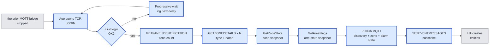
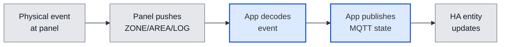
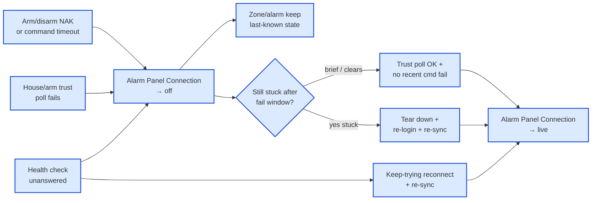
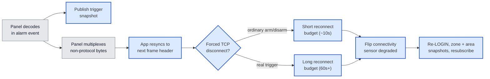

# Architecture

<!-- Synthesised by /architecture on 2026-08-10 from: adr-001-use-dynamic-panel-enumeration-for-zone-discovery.md, adr-002-use-frame-resync-and-asymmetric-reconnect-for-panel-protocol-collisions.md, adr-003-use-mqtt-discovery-not-native-integration-for-entity-surfacing.md, adr-004-use-app-liveness-unavailability-and-trigger-snapshots-for-panel-link-outages.md, adr-006-use-panel-zone-state-snapshot-for-startup-re-sync.md, adr-008-use-confirmed-shared-arm-disarm-with-away-full-arm-and-home-night-part-arm-mapping.md, adr-009-use-panel-area-flags-snapshot-for-alarm-startup-re-sync.md, adr-010-use-command-reject-events-and-periodic-house-state-polling-for-silent-panel-path-death-detection.md, adr-011-use-automatic-session-recovery-for-mid-run-panel-path-failures.md -->

**Date:** 2026-08-10
**State:** Draft 📝
<!-- Update 2026-08-10: folded ADR-011 + Accepted spec-panel-session-heal (mid-run session recovery; Alarm Panel Connection naming). -->
<!-- Prior: 2026-08-09 folded Accepted spec-startup-login-backoff (progressive first-login waits). -->

## Overview

The household today arms, disarms, and watches its alarm through `the prior MQTT bridge`. Two
specific behaviours motivate this project: arming to Home mode has never completed
without an add-on crash, and crashes/restarts happen occasionally under other
conditions too — both empirically confirmed against the live panel in this project's
own spikes. Every day, several times a day, the household's automations, dashboard,
and HomeKit bridges all depend on `the prior MQTT bridge` staying up. The same app is also
intended for other Premier Elite households, published as a public Home Assistant
Add-on with install-time options for facts that differ per panel.

The Texecom Alarm App takes over that role: a self-built Home Assistant App (add-on)
that lives on the same Home Assistant OS host, takes over the alarm panel's single
ComIP connection once `the prior MQTT bridge` is stopped, and republishes everything Home
Assistant already consumes — zone state and alarm state — over the same MQTT discovery
mechanism `the prior MQTT bridge` uses today. Nothing on the consuming side (the
`house_alarm_panel` template wrapper, its automations, the Security dashboard, the
HomeKit bridges) needs to change to keep working.

The hard part here isn't scale — this is a handful of TCP messages a second against 40
in-use zones. It's two coordination problems the live panel itself forces: the panel's
own SmartCom/ComIP hardware periodically pollutes the same TCP session with unrelated
modem traffic around arm/disarm/trigger events — a real, panel-level behaviour that
any client assuming every byte is Connect-protocol will trip over, regardless of which
software is on the other end; and the panel's ComIP module only accepts one TCP client
at a time, so the handoff between `the prior MQTT bridge` and this app has to be sequenced
deliberately, not just installed alongside it.

Building this commits the project to:

- Discovering the zone list from the panel itself at every startup, rather than
  hand-maintaining one in configuration.
- After login (and again after a reconnect re-login), reading a full current-state
  snapshot of every zone from the panel and publishing that for in-use zones before
  treating entities as current — live change events then keep them updated, rather
  than waiting for the next physical change or relying on retained MQTT alone.
- After login (and again after a reconnect re-login), reading a current area/arm-state
  snapshot from the panel and publishing that for the alarm entity before treating it
  as current — live area/log change events then keep it updated, rather than assuming
  disarmed or relying on retained MQTT alone.
- Treating any unrecognised byte on the wire as recoverable rather than fatal, and
  reconnecting with a budget that is deliberately longer after a real alarm trigger
  than after an ordinary arm or disarm.
- Publishing to Home Assistant purely via MQTT discovery, with all household-specific
  arming and notification logic staying entirely outside this app.
- Issuing arm and disarm with the empirically confirmed shared command mechanism.
  Away always uses the panel's full-arm mode; Home and Night map to Part-Arm slots
  from per-installation configuration (Home / Night / Unused only — Away is never a
  Part-Arm option), rather than hardcoding this household's engineer layout.
- Keeping **Alarm Panel Connection** truthful when the path still looks alive but is
  not trustworthy: a rejected or timed-out arm/disarm is an immediate degrade signal,
  and a separate periodic house/arm-state poll checks trust alongside the idle
  heartbeat — not “zones went quiet,” and not heartbeat failure alone (ADR-010).
- Healing mid-run panel failures without a manual add-on restart: when the usual
  health check goes unanswered, use the same keep-trying reconnect path as a clean
  drop; when trust stays broken after a short check window, tear down and log in
  again. Do not silently re-fire a failed arm/disarm tap (ADR-011 /
  `spec-panel-session-heal`).

**Diagram colours:** blue = this system (authored components and local storage); grey =
external people and systems.

**Names used below:** Texecom Alarm App.

### In the wider system

The app sits between the physical alarm panel and the household's existing Home
Assistant setup, talking to each over a completely different protocol.

### Components at a glance

This project has a single project-owned peer, **Texecom Alarm App** — there is no
second codebase to map here. Its two external dependencies (the panel and the MQTT
broker) and its internal shape are detailed under `## Components` below.

### When things go wrong

- **Panel unreachable at startup** — the app cannot build any zone/alarm entities
  until panel login succeeds; there is no offline or cached fallback in this
  architecture. While waiting, the process stays up and retries first
  connect/login with progressive waits (5 s → 10 s → 20 s → 30 s, then 30 s
  until success), logging each next wait so operators can tell patience from a
  hang (`spec-startup-login-backoff`). This schedule does not redefine mid-run
  reconnect patience after a session was already healthy (ADR-002).
- **Unexpected byte on the wire** — the app scans forward for the next valid frame
  header instead of tearing down the connection (ADR-002).
- **Connection dropped** — the app reconnects with a budget sized to what dropped it
  (short after an ordinary arm/disarm, much longer after a real trigger) and flips
  **Alarm Panel Connection** off for the duration (ADR-002). The `alarm_control_panel`
  and zone entities themselves keep reporting their last known state throughout —
  they are never marked unavailable because of this; only the app process itself being
  down does that (ADR-004).
- **Session looks live but is untrustworthy** — arm/disarm reject or timeout, or a
  failed house/arm-state trust poll, flips **Alarm Panel Connection** off even while
  the idle heartbeat still succeeds (ADR-010). Brief glitches may clear on the next
  successful check; if trust stays broken past a bounded fail window, the app tears
  down and logs in again (ADR-011). Zone/alarm entities keep last-known state
  (ADR-004). Failed arm/disarm taps are not auto-retried.
- **Health check unanswered mid-run** — treat like a dead session: Connection stays
  off, keep trying the same reconnect path used after a clean panel drop, then
  re-sync zone/alarm state when the panel accepts again — no manual restart
  (ADR-011). Not the same schedule as progressive first-login backoff.
- **MQTT broker unreachable** — out of scope to solve beyond standard client
  reconnect behaviour; this app has the same standing dependency on the broker that
  `the prior MQTT bridge` does today.

## Components

### Texecom Alarm App

A single long-running process that speaks the Texecom Connect binary protocol to the
alarm panel on one side, and Home Assistant's MQTT discovery protocol on the other. It
owns no other project-owned peers — Home Assistant, the MQTT broker, and the panel are
all externally owned.

**Role:** Bridges the Texecom Premier Elite panel's ComIP/Connect-protocol session to
Home Assistant, taking over the role `the prior MQTT bridge` plays today.
**Technology:** Python 3, packaged as a Home Assistant App (Docker image on
`ghcr.io/home-assistant/base`, s6-overlay-supervised process) — the App-not-integration
shape is ADR-003; language and packaging are the shipping stack (Python itself has no
dedicated ADR). Framing/CRC/resync/decode and arm/disarm command work were validated
live against the panel in SPIKE-001, SPIKE-002, and SPIKE-005 (production command
mapping is ADR-008).
**Exposes:** Home Assistant MQTT discovery topics and their paired state/command
topics for: one `alarm_control_panel` entity; one `binary_sensor` entity per in-use
zone; one dedicated connectivity/freshness `binary_sensor` — friendly name
**Alarm Panel Connection** — reporting panel-link health (ADR-004;
`spec-panel-session-heal`); and a "last trigger" snapshot attribute (initiating zone,
timestamp) on the alarm entity (ADR-004). No HTTP API, no HA config-flow, no
entity-registry presence beyond what HA's own MQTT integration creates from these
discovery payloads (ADR-003). Clean rename of that connectivity entity’s
`unique_id` / Entity ID is in scope (no backwards-compat soft path).
**Consumes:**
- Texecom Connect protocol over TCP to the panel's ComIP module (ADR-001, ADR-002,
  ADR-006, ADR-008, ADR-009, ADR-010, ADR-011).
- The household's MQTT broker, as a standing runtime dependency (ADR-003) — the same
  broker `the prior MQTT bridge` already uses today.
- App configuration (panel host/port, UDL password, MQTT broker settings, and the
  Home/Night→Part-Arm slot mapping) via the HA Supervisor's
  `config.yaml`/`options.json`/`bashio::config` mechanism, already scaffolded in this
  repo (ADR-008 requires Home/Night→slot to be install-time configuration with Away
  excluded from Part-Arm options; the exact option shape is still open — see Open
  questions).

Key behaviours:

- **Startup / first-login progressive backoff** (`spec-startup-login-backoff`, on
  `spec-continuous-operation`): until the first successful panel connect/login
  (including after an add-on restart), failed attempts do not exit the process.
  After the *k*-th failure (`k = 1, 2, 3, …`), wait
  `min(5 × 2^(k-1), 30)` seconds before the next try — **5 s → 10 s → 20 s →
  30 s**, then **30 s** forever until success. Cap is **30 seconds**; never wait
  longer; never give up. Recovery logs must name the wait that will be used
  before the next try. Distinct from ADR-002 asymmetric reconnect after a
  previously healthy session drops. FakePanel must exercise fail-then-succeed and
  capped-wait shapes for CI.
- **Startup / zone discovery** (ADR-001): after the first successful connect/login
  (including the ≥500ms post-connect wait and UDL password login — factory default
  `1234`, confirmed in SPIKE-001 — not blank), sends `GETPANELIDENTIFICATION` for
  the zone count, then loops `GETZONEDETAILS` across every zone number and discards
  any slot the panel reports as `zoneType=0` (unused) rather than creating an entity
  for it.
- **Startup / reconnect zone-state snapshot** (ADR-006): after LOGIN (and again after
  a reconnect re-LOGIN), sends `GetZoneState` (cmd `2`) with body
  `[startZone][zoneCount]` (1-byte `startZone` when panel zone count ≤ 256; batches of
  up to 168 zones per request) and receives one status byte per requested zone. Low
  two bits decode as Secure / Active / Tamper / Short — the same map used for
  unsolicited ZONE push events. Publishes MQTT state for in-use zones from that
  snapshot before treating entities as current. Not a substitute for push updates;
  FakePanel (or equivalent) must speak the same read for CI.
- **Startup / reconnect area-flags snapshot** (ADR-009): after LOGIN (and again after
  a reconnect re-LOGIN), sends `GetAreaFlags` (cmd `11`) with body `[start][count]`
  (this Elite 88: `start=0`, `count=72`, `area_size=1` derived from zone count 88) and
  receives `count * area_size` flag bytes. Per-area bits decode with priority
  Alarm(0) → InAlarm; else Armed(21)/FullArmed(22)/PartArmed(23)/ForceArmed(26) →
  Armed or PartArmed (+ PartArm1/2/3 slot); else Disarmed — the same meaning used
  when interpreting live AREA events for settled states. Publishes MQTT alarm state
  for in-use areas from that snapshot before treating the alarm entity as current.
  Part-Arm slot → HA Home/Night remains install-time config (ADR-008); Away is full
  arm, not a Part-Arm label — not auto-detected from the snapshot. Not a substitute
  for push updates; FakePanel (or equivalent) must speak the same read for CI.
  Exit/entry (`arming`/`pending`) may still depend on live AREA pushes until
  corroborated in the flag block.
- **Event subscription and steady-state decode**: sends `SETEVENTMESSAGES` to
  subscribe to `ZONE`/`AREA`/`OUTPUT`/`USER`/`LOG` push messages, then decodes each
  unsolicited message into the corresponding zone/alarm state and publishes it as an
  MQTT state update. Zone/arm *entity* currency in steady state is still push-driven
  (ADR-006 / ADR-009 snapshots remain startup / reconnect only). Separately, ADR-010
  adds a bounded periodic house/arm-state *trust* poll — not a replacement for push
  updates and not “degrade when zones go quiet.”
- **Idle keepalive and ordinary collision recovery**: sends a safe read-only command
  (e.g. `GETDATETIME`) periodically; on a 2–3s timeout, resends with the same sequence
  number, matching the panel's own documented and empirically-confirmed recovery
  behaviour (ADR-002). This keepalive is session keep-alive only — not proof the path
  is trustworthy for commands (ADR-010).
- **Silent panel-path death / command-path zombie detection** (ADR-010): arm/disarm
  NAK or command timeout immediately marks **Alarm Panel Connection** off even when
  keepalive still succeeds. A periodic house/arm-state trust poll (same family as the
  ADR-009 area-flags read, on a plan-time interval; shipping lock **30 s** for the
  order-of-tens recover window unless live walks force a change) also marks off on
  poll failure. Missing zone push traffic alone must not be the sole degrade criterion.
  Brief failures may return to live after a successful trust poll once the recent
  command-failure recover window has cleared, without a manual add-on restart.
  FakePanel must exercise the SPIKE-008 detector shapes for CI.
- **Mid-run session heal** (ADR-011 / `spec-panel-session-heal`): unanswered mid-run
  health-check (e.g. keepalive timeout) must **not** abort the listen loop — enter the
  same keep-trying reconnect path as a clean panel drop (Connection off while
  recovering; re-LOGIN + ADR-006/ADR-009 snapshots + resubscribe when the panel
  accepts). Soft trust-degrade: corroborate first; if still stuck after a bounded fail
  window (exact length at `/plan` / live tuning), tear down and log in again. Do not
  auto-retry the failed arm/disarm command. FakePanel must cover health-check →
  reconnect-heal, trust-fail → corroboration recover, and trust-fail → bounded
  re-login.
- **Frame resync** (ADR-002): treats a byte that doesn't match the expected frame
  header as recoverable — scans forward for the next valid header instead of raising —
  because the panel's own SmartCom/ComIP hardware is confirmed to multiplex unrelated
  modem traffic onto the same session around arm/disarm/trigger events, on ordinary
  keypad use alone.
- **Asymmetric reconnect** (ADR-002): on a dropped connection — and, per ADR-011, on
  an unanswered mid-run health-check — uses a short retry budget (~10s) after an
  ordinary arm/disarm-adjacent drop, and a substantially longer budget (tens of
  seconds to a minute or more) after a real-trigger-adjacent forced disconnect,
  flipping **Alarm Panel Connection** off throughout — never the
  `alarm_control_panel`/zone entities themselves (ADR-004). Exact budgets remain
  tunable (ADR-002 / ADR-011 open follow-ons); ADR-011 does not newly finalise them.
- **Availability and trigger snapshot** (ADR-004): the `alarm_control_panel` and zone
  entities' availability is governed solely by whether the app process itself is
  running (MQTT Last-Will) — never by panel-link health, so a panel-link outage never
  blanks them. A dedicated connectivity `binary_sensor` carries panel-link health
  separately. The app also keeps a short rolling buffer of recent zone/log activity
  and publishes a "last trigger" snapshot (initiating zone, timestamp) the instant it
  decodes a transition into `in alarm`, so the household retains immediate context
  even if the ensuing reconnect takes the full observed window to complete.
- **Cutover dependency** (ADR-001): because the panel's ComIP module accepts only one
  TCP client at a time, `the prior MQTT bridge` must be fully stopped — not merely idle —
  before this app's first connection attempt.
- **Arm/disarm command handling** (ADR-008): accepts `arm_away` / `arm_night` /
  `arm_home` / `disarm` on the `alarm_control_panel` MQTT command topic and issues the
  confirmed shared Connect-protocol commands — `cmd=6` with a mode byte for arm, and
  `cmd=8, body=01` for mode-independent disarm (including cancel-during-exit). Away
  always uses the panel full-arm mode byte (`00` on the investigated household), never
  a Part-Arm slot index. Home and Night mode bytes are the Part-Arm slot numbers from
  install-time configuration (Home / Night / Unused only — Away must not appear as a
  Part-Arm option). Home/Night→slot is never hardcoded to this household's layout;
  `GETAREADETAILS` cannot auto-detect Night/Home slot roles and must not be treated as
  a source for that mapping.

## Key flows

### Startup and zone discovery

Runs once per app start, after the operator has stopped `the prior MQTT bridge` as a one-time
cutover step (the ComIP module will not accept a second client while `the prior MQTT bridge`
still holds the session).

Until first login succeeds, the app stays running and retries with the progressive
startup backoff above (not the mid-run reconnect budget). Zone slots the panel
reports as unused are dropped during the `GETZONEDETAILS` loop and never reach the
discovery-publish step, so Home Assistant never sees a dead entity for them. The `GetZoneState` snapshot (ADR-006) supplies correct initial open/closed
values for in-use zones on every start (and after reconnect), so zone entities do not
wait for the next physical change or rely on retained MQTT alone. The `GetAreaFlags`
snapshot (ADR-009) supplies correct initial armed/disarmed/part-armed/in-alarm state
for the alarm entity the same way — Part-Arm slot → HA Home/Night still comes from
install-time configuration (ADR-008); Away is full arm, not a Part-Arm label from the
snapshot itself.

### Steady-state zone and alarm reporting

The normal operating loop once discovery has published, for every physical event at
the panel.

Entity state updates in this flow stay push-driven: after the ADR-006 zone and
ADR-009 area-flags startup / reconnect snapshots, ongoing zone/alarm *entity*
changes arrive as unsolicited pushes once `SETEVENTMESSAGES` has been sent
(panel reporting latency observed within the same wall-clock second in
SPIKE-002). That is separate from ADR-010’s bounded periodic house/arm-state
*trust* poll, which runs alongside the idle keepalive to corroborate that the
session remains trustworthy — it is not a substitute for push updates, not a
client-tunable entity-state poll cadence, and must not degrade solely because
zones go quiet.

### Panel-link trust and mid-run heal

How **Alarm Panel Connection** stays honest when the TCP path still looks alive
(ADR-010), how mid-run death or stuck trust recovers without a restart (ADR-011),
and how zone/alarm entities keep last-known state throughout (ADR-004).

A rejected or timed-out arm/disarm is an immediate “Connection off” *event* even when
the idle heartbeat still succeeds. The periodic house/arm-state poll is a separate
trust check (alongside keepalive). Brief glitches may return to live after a
successful check once the recent-command-failure window has cleared. If trust stays
broken past the fail window, tear down and log in again. An unanswered mid-run health
check takes the keep-trying reconnect path used after a clean drop — not process exit
and not “wait for a human restart.” Failed arm/disarm taps are never auto-retried as
part of heal. Exact fail-window length and how patient retry cadence lines up with
existing mid-run reconnect budgets stay plan-time / live-tunable (ADR-011).

### Protocol collision recovery

The flow that exists specifically because of the confirmed crash mechanism: the
panel's own hardware, not client timing, is the source of the disruption.

Most collisions never reach the "forced disconnect" branch at all — resync alone
keeps the session alive through an ordinary arm/disarm's corrupted-byte burst, as
SPIKE-002 demonstrated twice. Only a real trigger has been confirmed to force a full
disconnect. After a forced disconnect recovers, Resume re-runs LOGIN, the ADR-006
zone-state snapshot, the ADR-009 area-flags snapshot, and `SETEVENTMESSAGES` before
live reporting continues. The `alarm_control_panel` entity itself is unaffected by
this whole flow — it keeps reporting `triggered` throughout; only the dedicated
connectivity `binary_sensor` reflects the degraded/recovering link (ADR-004).

### Arm/disarm command

Household arm/disarm arrives via the unchanged `house_alarm_panel` wrapper onto this
app's MQTT command topic; the app maps Away to full arm and Home/Night through
install-time Part-Arm slot configuration, then issues the confirmed Connect-protocol
command (ADR-008).

```mermaid
flowchart LR
    Cmd["Household arm/disarm<br/>via HA / HomeKit"]:::external
    Wrapper["house_alarm_panel<br/>wrapper (unchanged)"]:::external
    MqttCmd["MQTT command<br/>topic"]:::external
    Recv["App receives<br/>command"]:::owned
    Map["Map HA mode via<br/>install-time config"]:::owned
    Send["Issue confirmed<br/>arm or disarm cmd"]:::owned
    Panel["Panel ACKs +<br/>AREA/LOG events"]:::external

    Cmd --> Wrapper --> MqttCmd --> Recv --> Map --> Send --> Panel

    classDef owned fill:#dbeafe,stroke:#1d4ed8,stroke-width:2px
    classDef external fill:#e5e7eb,stroke:#6b7280,color:#111827
```

Away, Night, Home, and Disarm are all implementable from SPIKE-005 / ADR-008. Away is
always the full-arm mode byte; the only install-specific input is which Part-Arm slot
is Home vs Night (Unused allowed) — documented add-on options, not code. Away must not
appear on that Part-Arm option surface.

## Outside systems & tests

| Outside system | In CI | What CI may claim | Live-only |
|---|---|---|---|
| Texecom panel (ComIP) | Stand-in: FakePanel | Login, zone enumerate, zone-state and area-flags snapshots, arm/disarm mode-byte selection (Away = full arm; Home/Night = configured slots), frame resync, reconnect paths; silent-death / command-reject / quiet-house detector shapes (ADR-010 / SPIKE-008); mid-run health-check → reconnect-heal and trust-fail → corroboration / bounded re-login (ADR-011); progressive startup-login backoff (fail-N-then-succeed waits strictly increasing then capped at 30 s; recovery without process exit) | Real Away/Night/Home arm sequences, trigger-time forced disconnect recovery, live quiet-house / zombie corroboration, mid-run heal under real ComIP contention; live Supervisor timing (RISK-015) |
| MQTT broker | Hermetic / test broker (or FakePanel + recording MQTT client) | Discovery payloads, state/command publish/subscribe, connectivity sensor and last-trigger snapshot attributes | Household HA entity behaviour, wrapper/HomeKit/automations |

CI never targets the live household panel or a production broker account. Product
validation of live behaviour belongs at `/accept` (optional go-live smoke at `/ship`).

## Security, operations, scope, and open questions

**Security:** The panel is protected only by its factory-default UDL password (`1234`,
confirmed live in SPIKE-001), reachable solely over the household LAN — an inherited,
pre-existing condition (RISK-009), not something this app changes. MQTT broker
credentials are supplied via the same HA Supervisor config mechanism as the panel's;
no new external network exposure is introduced.

**Logging and monitoring:** Standard `bashio::log` output via the s6-supervised
process, plus a dedicated connectivity/freshness `binary_sensor` (**Alarm Panel
Connection**) published over MQTT that reflects off/recovering panel-link health
during recovery windows (ADR-002, ADR-004), silent-death / command-reject detection
(ADR-010), and mid-run session heal (ADR-011) — the `alarm_control_panel`/zone
entities themselves are not used for this signal, since their own last-known state
must stay visible throughout (ADR-004). Everyday logs must make recovery attempts and
failures obvious (not TRACE-only). Startup first-login failures must log the wait
duration before the next try (`spec-startup-login-backoff`) so operators can
distinguish backoff from a hang.

**Deployment:** Ships as a Home Assistant App (add-on) using the existing
`config.yaml`/`Dockerfile`/`rootfs` scaffold (arch: `aarch64`, `amd64`), run as a
single s6-supervised process that restarts automatically on a non-zero exit. Cutover
from `the prior MQTT bridge` is a hard sequencing step, not a side-by-side rollout: `the prior MQTT bridge`
must be stopped before this app's first connection attempt, because the panel's ComIP
module accepts only one TCP client at a time (ADR-001).

**Out of scope.**

- Building or changing the Lovelace dashboard or HomeKit exposure — both keep working
  off the same entity names/states this app publishes.
- Reimplementing the arm guard-condition or notification logic that lives in
  `configuration/templates/house_alarm.yaml` / `script.notify_actor` — stays entirely
  in the household's own Home Assistant configuration (ADR-003).
- Support for the older UDL/Wintex serial protocol, or panel families other than
  Premier Elite.
- A guided config-flow/setup-wizard UI, HACS packaging, or a natively-registered
  `custom_components` integration — distribution is a public Add-on repository with
  documented options (ADR-003; brief non-goals).

**Open questions.**

- **Exact reconnect wait times/retry counts are not finalised** (ADR-002 follow-on;
  only one real trigger data point exists). This architecture assumes a short (~10s)
  budget for arm/disarm-adjacent drops and a longer, configurable (60s+) budget for
  trigger-adjacent drops — treat both as tunable defaults, not final values. ADR-011
  heal cadence may align with these; do not treat them as newly finalised by heal alone.
- **What "alarm reset" means as a product-observable signal is unresolved** (ADR-002
  follow-on) — no distinct Connect-protocol event was observed for clearing the
  alarm-memory indicator. This architecture assumes the `AREA` event returning to
  `armed`/`disarmed` is the practical signal — needs confirmation before building a
  dedicated reset signal. Distinct from SPIKE-009 (whether cmd 9 is required on the wire).
- **Whether the ComIP module's one-connection-at-a-time behaviour is a fixed
  hardware/firmware limit or a configurable installer setting** was not tested — cutover
  still assumes a hard stop of `the prior MQTT bridge` before this app connects (ADR-001).
- **Whether to add a last-known-good cached zone list fallback** when the panel can't be
  reached at startup (ADR-001 Option C) remains an open follow-on — no offline fallback
  in this architecture.
- **How exit/entry (arming/pending) appear in the area-flags snapshot** versus only on
  live AREA pushes was not observed in SPIKE-007 (ADR-009). Use live AREA pushes for
  those transients until corroborated.
- **Concrete shape of the Part-Arm mapping add-on options** (ADR-008) — e.g. three
  fields vs one ordered list — settles at `/plan` / build; Away must stay excluded.
- **Com Port / reporting isolation** (RISK-011) remains an optional installer probe; do
  not assume it shortens the trigger-time forced disconnect (ADR-004).
- **Whether production disarm while `triggered` must send ResetArea (cmd 9) before
  disarm (cmd 8)** remains open (RISK-018 / SPIKE-009). Do not wire cmd 9 until that
  live spike validates ACK/effect on this Elite 88.

## Review

| # | Date | Verdict | Issues |
|---|------|---------|--------|
| 1 | 2026-08-03 | Issues found | 1 |
| 2 | 2026-08-03 | Clear | — |
| 3 | 2026-08-04 | Clear | — |
| 4 | 2026-08-04 | Issues found | 1 |
| 5 | 2026-08-04 | Clear | — |
| 6 | 2026-08-04 | Clear | — |
| 7 | 2026-08-08 | Clear | — |
| 8 | 2026-08-09 | Issues found | 1 |
| 9 | 2026-08-09 | Clear | — (review-8 Key flows ADR-010 contradiction fixed) |
| 10 | 2026-08-09 | Clear | — |
| 11 | 2026-08-09 | Clear | — |
| 12 | 2026-08-10 | Issues found | 1 |

**Open issues (from review 12):**
- Technology choice without ADR or open question: peer Technology names **Python 3**, which is not decided by any accepted ADR (ADR-003 covers MQTT discovery / App-not-integration only) and is not named in Open questions — the Technology field itself notes Python has no dedicated ADR.
