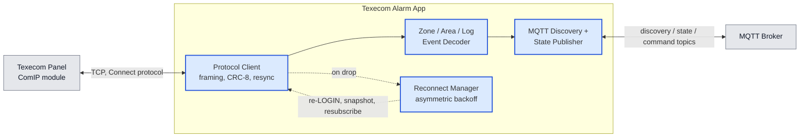
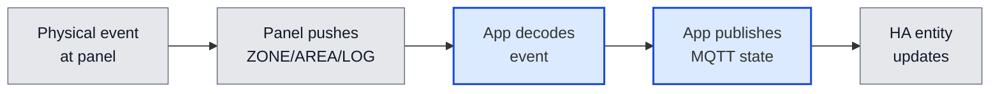
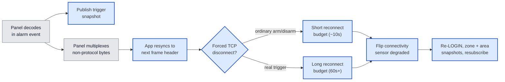

```mermaid
flowchart LR
    Cmd["Household arm/disarm<br/>via HA / HomeKit"]:::external
    Wrapper["house_alarm_panel<br/>wrapper (unchanged)"]:::external
    MqttCmd["MQTT command<br/>topic"]:::external
    Recv["App receives<br/>command"]:::owned
    Map["Map HA mode via<br/>install-time config"]:::owned
    Send["Issue confirmed<br/>arm or disarm cmd"]:::owned
    Panel["Panel ACKs +<br/>AREA/LOG events"]:::external

    Cmd --> Wrapper --> MqttCmd --> Recv --> Map --> Send --> Panel

    classDef owned fill:#dbeafe,stroke:#1d4ed8,stroke-width:2px
    classDef external fill:#e5e7eb,stroke:#6b7280,color:#111827
```

# Architecture

<!-- Synthesised by /architecture on 2026-08-04 from: adr-001-use-dynamic-panel-enumeration-for-zone-discovery.md, adr-002-use-frame-resync-and-asymmetric-reconnect-for-panel-protocol-collisions.md, adr-003-use-mqtt-discovery-not-native-integration-for-entity-surfacing.md, adr-004-use-app-liveness-unavailability-and-trigger-snapshots-for-panel-link-outages.md, adr-005-use-confirmed-shared-arm-disarm-commands-with-configurable-part-arm-mapping.md, adr-006-use-panel-zone-state-snapshot-for-startup-re-sync.md, adr-007-use-panel-area-flags-snapshot-for-alarm-startup-re-sync.md -->

**Date:** 2026-08-04
**State:** Accepted ✅

## Overview

The household today arms, disarms, and watches its alarm through `the prior MQTT bridge`. Two
specific behaviours motivate this project: arming to Home mode has never completed
without an add-on crash, and crashes/restarts happen occasionally under other
conditions too — both empirically confirmed against the live panel in this project's
own spikes. Every day, several times a day, the household's automations, dashboard,
and HomeKit bridges all depend on `the prior MQTT bridge` staying up. The same app is also
intended for other Premier Elite households, published as a public Home Assistant
Add-on with install-time options for facts that differ per panel.

The Texecom Alarm App takes over that role: a self-built Home Assistant App (add-on)
that lives on the same Home Assistant OS host, takes over the alarm panel's single
ComIP connection once `the prior MQTT bridge` is stopped, and republishes everything Home
Assistant already consumes — zone state and alarm state — over the same MQTT discovery
mechanism `the prior MQTT bridge` uses today. Nothing on the consuming side (the
`house_alarm_panel` template wrapper, its automations, the Security dashboard, the
HomeKit bridges) needs to change to keep working.

The hard part here isn't scale — this is a handful of TCP messages a second against 40
in-use zones. It's two coordination problems the live panel itself forces: the panel's
own SmartCom/ComIP hardware periodically pollutes the same TCP session with unrelated
modem traffic around arm/disarm/trigger events — a real, panel-level behaviour that
any client assuming every byte is Connect-protocol will trip over, regardless of which
software is on the other end; and the panel's ComIP module only accepts one TCP client
at a time, so the handoff between `the prior MQTT bridge` and this app has to be sequenced
deliberately, not just installed alongside it.

Building this commits the project to:

- Discovering the zone list from the panel itself at every startup, rather than
  hand-maintaining one in configuration.
- After login (and again after a reconnect re-login), reading a full current-state
  snapshot of every zone from the panel and publishing that for in-use zones before
  treating entities as current — live change events then keep them updated, rather
  than waiting for the next physical change or relying on retained MQTT alone.
- After login (and again after a reconnect re-login), reading a current area/arm-state
  snapshot from the panel and publishing that for the alarm entity before treating it
  as current — live area/log change events then keep it updated, rather than assuming
  disarmed or relying on retained MQTT alone.
- Treating any unrecognised byte on the wire as recoverable rather than fatal, and
  reconnecting with a budget that is deliberately longer after a real alarm trigger
  than after an ordinary arm or disarm.
- Publishing to Home Assistant purely via MQTT discovery, with all household-specific
  arming and notification logic staying entirely outside this app.
- Issuing arm and disarm with the empirically confirmed shared command mechanism, and
  sourcing which Part-Arm slot means Home/Night/Away from per-installation
  configuration rather than hardcoding this household's engineer layout.

**Diagram colours:** blue = this system (authored components and local storage); grey =
external people and systems.

**Names used below:** Texecom Alarm App.

### In the wider system

The app sits between the physical alarm panel and the household's existing Home
Assistant setup, talking to each over a completely different protocol.

### Components at a glance

This project has a single project-owned peer, **Texecom Alarm App** — there is no
second codebase to map here. Its two external dependencies (the panel and the MQTT
broker) and its internal shape are detailed under `## Components` below.

### When things go wrong

- **Panel unreachable at startup** — the app cannot build any zone/alarm entities
  until panel login succeeds; there is no offline or cached fallback in this
  architecture.
- **Unexpected byte on the wire** — the app scans forward for the next valid frame
  header instead of tearing down the connection (ADR-002).
- **Connection dropped** — the app reconnects with a budget sized to what dropped it
  (short after an ordinary arm/disarm, much longer after a real trigger) and flips a
  dedicated connectivity `binary_sensor` to degraded for the duration (ADR-002). The
  `alarm_control_panel` and zone entities themselves keep reporting their last known
  state throughout — they are never marked unavailable because of this; only the app
  process itself being down does that (ADR-004).
- **MQTT broker unreachable** — out of scope to solve beyond standard client
  reconnect behaviour; this app has the same standing dependency on the broker that
  `the prior MQTT bridge` does today.

## Components

### Texecom Alarm App

A single long-running process that speaks the Texecom Connect binary protocol to the
alarm panel on one side, and Home Assistant's MQTT discovery protocol on the other. It
owns no other project-owned peers — Home Assistant, the MQTT broker, and the panel are
all externally owned.

**Role:** Bridges the Texecom Premier Elite panel's ComIP/Connect-protocol session to
Home Assistant, taking over the role `the prior MQTT bridge` plays today.
**Technology:** Python 3, packaged as a Home Assistant App (Docker image on
`ghcr.io/home-assistant/base`, s6-overlay-supervised process) — the App-not-integration
shape is ADR-003; the language itself was decided directly during the original
architecture session (2026-08-03), building on the framing/CRC/resync/decode and
arm/disarm command work validated live against the panel in SPIKE-001, SPIKE-002, and
SPIKE-005 — it is not yet backed by its own ADR (see Open questions).
**Exposes:** Home Assistant MQTT discovery topics and their paired state/command
topics for: one `alarm_control_panel` entity; one `binary_sensor` entity per in-use
zone; one dedicated connectivity/freshness `binary_sensor` reporting panel-link health
(ADR-004); and a "last trigger" snapshot attribute (initiating zone, timestamp) on the
alarm entity (ADR-004). No HTTP API, no HA config-flow, no entity-registry presence
beyond what HA's own MQTT integration creates from these discovery payloads (ADR-003).
**Consumes:**
- Texecom Connect protocol over TCP to the panel's ComIP module (ADR-001, ADR-002,
  ADR-005, ADR-006, ADR-007).
- The household's MQTT broker, as a standing runtime dependency (ADR-003) — the same
  broker `the prior MQTT bridge` already uses today.
- App configuration (panel host/port, UDL password, MQTT broker settings, and the
  Part-Arm slot-to-HA-mode mapping) via the HA Supervisor's
  `config.yaml`/`options.json`/`bashio::config` mechanism, already scaffolded in this
  repo (ADR-005 requires the mapping to be install-time configuration; the exact option
  shape is still open — see Open questions).

Key behaviours:

- **Startup / zone discovery** (ADR-001): opens the TCP connection, waits ≥500ms, logs
  in with the UDL password (factory default `1234`, confirmed in SPIKE-001 — not
  blank), sends `GETPANELIDENTIFICATION` for the zone count, then loops
  `GETZONEDETAILS` across every zone number and discards any slot the panel reports as
  `zoneType=0` (unused) rather than creating an entity for it.
- **Startup / reconnect zone-state snapshot** (ADR-006): after LOGIN (and again after
  a reconnect re-LOGIN), sends `GetZoneState` (cmd `2`) with body
  `[startZone][zoneCount]` (1-byte `startZone` when panel zone count ≤ 256; batches of
  up to 168 zones per request) and receives one status byte per requested zone. Low
  two bits decode as Secure / Active / Tamper / Short — the same map used for
  unsolicited ZONE push events. Publishes MQTT state for in-use zones from that
  snapshot before treating entities as current. Not a substitute for push updates;
  FakePanel (or equivalent) must speak the same read for CI.
- **Startup / reconnect area-flags snapshot** (ADR-007): after LOGIN (and again after
  a reconnect re-LOGIN), sends `GetAreaFlags` (cmd `11`) with body `[start][count]`
  (this Elite 88: `start=0`, `count=72`, `area_size=1` derived from zone count 88) and
  receives `count * area_size` flag bytes. Per-area bits decode with priority
  Alarm(0) → InAlarm; else Armed(21)/FullArmed(22)/PartArmed(23)/ForceArmed(26) →
  Armed or PartArmed (+ PartArm1/2/3 slot); else Disarmed — the same meaning used
  when interpreting live AREA events for settled states. Publishes MQTT alarm state
  for in-use areas from that snapshot before treating the alarm entity as current.
  Part-Arm slot → HA Home/Night/Away remains install-time config (ADR-005), not
  auto-detected from the snapshot. Not a substitute for push updates; FakePanel (or
  equivalent) must speak the same read for CI. Exit/entry (`arming`/`pending`) may
  still depend on live AREA pushes until corroborated in the flag block.
- **Event subscription and steady-state decode**: sends `SETEVENTMESSAGES` to
  subscribe to `ZONE`/`AREA`/`OUTPUT`/`USER`/`LOG` push messages, then decodes each
  unsolicited message into the corresponding zone/alarm state and publishes it as an
  MQTT state update — no steady-state polling (the ADR-006 and ADR-007 snapshots are
  startup / reconnect only).
- **Idle keepalive and ordinary collision recovery**: sends a safe read-only command
  (e.g. `GETDATETIME`) periodically; on a 2–3s timeout, resends with the same sequence
  number, matching the panel's own documented and empirically-confirmed recovery
  behaviour (ADR-002).
- **Frame resync** (ADR-002): treats a byte that doesn't match the expected frame
  header as recoverable — scans forward for the next valid header instead of raising —
  because the panel's own SmartCom/ComIP hardware is confirmed to multiplex unrelated
  modem traffic onto the same session around arm/disarm/trigger events, on ordinary
  keypad use alone.
- **Asymmetric reconnect** (ADR-002): on a dropped connection, uses a short retry
  budget (~10s) after an ordinary arm/disarm-adjacent drop, and a substantially longer
  budget (tens of seconds to a minute or more) after a real-trigger-adjacent forced
  disconnect, flipping the dedicated connectivity `binary_sensor` to degraded
  throughout — never the `alarm_control_panel`/zone entities themselves (ADR-004).
- **Availability and trigger snapshot** (ADR-004): the `alarm_control_panel` and zone
  entities' availability is governed solely by whether the app process itself is
  running (MQTT Last-Will) — never by panel-link health, so a panel-link outage never
  blanks them. A dedicated connectivity `binary_sensor` carries panel-link health
  separately. The app also keeps a short rolling buffer of recent zone/log activity
  and publishes a "last trigger" snapshot (initiating zone, timestamp) the instant it
  decodes a transition into `in alarm`, so the household retains immediate context
  even if the ensuing reconnect takes the full observed window to complete.
- **Cutover dependency** (ADR-001): because the panel's ComIP module accepts only one
  TCP client at a time, `the prior MQTT bridge` must be fully stopped — not merely idle —
  before this app's first connection attempt.
- **Arm/disarm command handling** (ADR-005): accepts `arm_away` / `arm_night` /
  `arm_home` / `disarm` on the `alarm_control_panel` MQTT command topic and issues the
  confirmed shared Connect-protocol commands — `cmd=6` with a configurable mode byte
  for arm (this household's defaults are `00`/`01`/`02` = Away/Night/Home, overridable
  per install), and `cmd=8, body=01` for mode-independent disarm (including
  cancel-during-exit). The mode-byte mapping is never hardcoded to this household's
  Part-Arm layout; `GETAREADETAILS` cannot auto-detect Night/Home slot roles and must
  not be treated as a source for that mapping.

## Key flows

### Startup and zone discovery

Runs once per app start, after the operator has stopped `the prior MQTT bridge` as a one-time
cutover step (the ComIP module will not accept a second client while `the prior MQTT bridge`
still holds the session).

```mermaid
flowchart LR
    Stop["the prior MQTT bridge<br/>stopped"]:::external
    Open["App opens TCP,<br/>LOGIN"]:::owned
    Ident["GETPANELIDENTIFICATION<br/>zone count"]:::owned
    Loop["GETZONEDETAILS x N<br/>type + name"]:::owned
    ZoneSnap["GetZoneState<br/>zone snapshot"]:::owned
    AreaSnap["GetAreaFlags<br/>arm-state snapshot"]:::owned
    Pub["Publish MQTT<br/>discovery + zone + alarm state"]:::owned
    Sub["SETEVENTMESSAGES<br/>subscribe"]:::owned
    HAEnt["HA creates<br/>entities"]:::external

    Stop --> Open --> Ident --> Loop --> ZoneSnap --> AreaSnap --> Pub --> Sub --> HAEnt

    classDef owned fill:#dbeafe,stroke:#1d4ed8,stroke-width:2px
    classDef external fill:#e5e7eb,stroke:#6b7280,color:#111827
```

Zone slots the panel reports as unused are dropped during the `GETZONEDETAILS` loop
and never reach the discovery-publish step, so Home Assistant never sees a dead entity
for them. The `GetZoneState` snapshot (ADR-006) supplies correct initial open/closed
values for in-use zones on every start (and after reconnect), so zone entities do not
wait for the next physical change or rely on retained MQTT alone. The `GetAreaFlags`
snapshot (ADR-007) supplies correct initial armed/disarmed/part-armed/in-alarm state
for the alarm entity the same way — Part-Arm slot → HA Home/Night/Away still comes
from install-time configuration (ADR-005), not from the snapshot itself.

### Steady-state zone and alarm reporting

The normal operating loop once discovery has published, for every physical event at
the panel.

There is no client-tunable steady-state poll cadence here — after the ADR-006 zone
and ADR-007 area-flags startup / reconnect snapshots, ongoing state changes arrive as
unsolicited pushes only once `SETEVENTMESSAGES` has been sent, and the panel's own
reporting latency was observed to fall within the same wall-clock second as the
physical action in SPIKE-002.

### Protocol collision recovery

The flow that exists specifically because of the confirmed crash mechanism: the
panel's own hardware, not client timing, is the source of the disruption.

Most collisions never reach the "forced disconnect" branch at all — resync alone
keeps the session alive through an ordinary arm/disarm's corrupted-byte burst, as
SPIKE-002 demonstrated twice. Only a real trigger has been confirmed to force a full
disconnect. After a forced disconnect recovers, Resume re-runs LOGIN, the ADR-006
zone-state snapshot, the ADR-007 area-flags snapshot, and `SETEVENTMESSAGES` before
live reporting continues. The `alarm_control_panel` entity itself is unaffected by
this whole flow — it keeps reporting `triggered` throughout; only the dedicated
connectivity `binary_sensor` reflects the degraded/recovering link (ADR-004).

### Arm/disarm command

Household arm/disarm arrives via the unchanged `house_alarm_panel` wrapper onto this
app's MQTT command topic; the app maps the HA arm mode through install-time Part-Arm
configuration and issues the confirmed Connect-protocol command (ADR-005).

Away, Night, Home, and Disarm are all implementable from SPIKE-005 / ADR-005. The
only install-specific input is which mode byte corresponds to which HA arm mode —
documented add-on options, not code.

## Security, operations, scope, and open questions

**Security:** The panel is protected only by its factory-default UDL password (`1234`,
confirmed live in SPIKE-001), reachable solely over the household LAN — an inherited,
pre-existing condition (RISK-009), not something this app changes. MQTT broker
credentials are supplied via the same HA Supervisor config mechanism as the panel's;
no new external network exposure is introduced.

**Logging and monitoring:** Standard `bashio::log` output via the s6-supervised
process, plus a dedicated connectivity/freshness `binary_sensor` published over MQTT
that reflects degraded panel-link health during recovery windows (ADR-002, ADR-004) —
the `alarm_control_panel`/zone entities themselves are not used for this signal, since
their own last-known state must stay visible throughout (ADR-004).

**Deployment:** Ships as a Home Assistant App (add-on) using the existing
`config.yaml`/`Dockerfile`/`rootfs` scaffold (arch: `aarch64`, `amd64`), run as a
single s6-supervised process that restarts automatically on a non-zero exit. Cutover
from `the prior MQTT bridge` is a hard sequencing step, not a side-by-side rollout: `the prior MQTT bridge`
must be stopped before this app's first connection attempt, because the panel's ComIP
module accepts only one TCP client at a time (ADR-001).

**Out of scope.**

- Building or changing the Lovelace dashboard or HomeKit exposure — both keep working
  off the same entity names/states this app publishes.
- Reimplementing the arm guard-condition or notification logic that lives in
  `configuration/templates/house_alarm.yaml` / `script.notify_actor` — stays entirely
  in the household's own Home Assistant configuration (ADR-003).
- Support for the older UDL/Wintex serial protocol, or panel families other than
  Premier Elite.
- A guided config-flow/setup-wizard UI, HACS packaging, or a natively-registered
  `custom_components` integration — distribution is a public Add-on repository with
  documented options (ADR-003; brief non-goals).

**Open questions.**

- **Python 3 was decided directly in the original architecture session**, not by a
  standing ADR. → run `/adr` if this should be formally, immutably recorded before
  build begins. (Docker packaging and the s6-overlay-supervised process are not a
  comparable decision point — both are inherited, platform-mandated requirements of
  building any Home Assistant App/add-on at all.)
- ~~**Entity ID/naming migration** (RISK-005): should new entity IDs exactly match
  today's `alarm_control_panel.texecom_alarm_arm_status` /
  `binary_sensor.texecom_alarm_*` naming, or is a documented rename acceptable?~~
  **Answered 2026-08-05:** Use the `texecom_alarm_*` scheme — alarm keeps
  `texecom_alarm_arm_status`; zones use `texecom_alarm_{slug}_{zone_number}` for
  uniqueness (not bit-identical to legacy `texecom_alarm_<slug>`). MQTT discovery
  sets `object_id`/`unique_id` plus `default_entity_id` so HA does not derive IDs
  from friendly names. Exact legacy parity / automation cutover is deferred.
- **Exact reconnect wait times/retry counts are not finalised** (ADR-002 follow-on;
  only one real trigger data point exists). This architecture assumes a short (~10s)
  budget for arm/disarm-adjacent drops and a longer, configurable (60s+) budget for
  trigger-adjacent drops — treat both as tunable defaults, not final values.
- **What "alarm reset" means as a product-observable signal is unresolved** (ADR-002
  follow-on) — no distinct Connect-protocol event was observed for clearing the
  alarm-memory indicator, even in a dedicated follow-up test. This architecture
  assumes the `AREA` event returning to `armed`/`disarmed` is the practical signal,
  not a still-unobserved `LOG type=45` event — needs confirmation before
  implementation.
- **Whether the ComIP module's one-connection-at-a-time behaviour is a fixed
  hardware/firmware limit or a configurable installer setting** was not tested by any
  spike — this affects whether a side-by-side testing period alongside `the prior MQTT bridge`
  is ever possible, or whether cutover must always be a hard stop-then-start.
- **Whether to add a last-known-good cached zone list fallback** for when the panel
  can't be reached at startup (ADR-001's Option C) is an explicit open follow-on, not
  part of this architecture — there is currently no offline/static fallback at all.
- **How exit/entry (arming/pending) appear in the area-flags snapshot** versus only
  on live AREA pushes was not observed in SPIKE-007's Disarmed-only run (ADR-007
  follow-on). This architecture still uses live AREA pushes for those transients
  until corroborated. → optional follow-up probe; not a blocker for settled-state
  snapshot.
- **Concrete shape of the Part-Arm mapping add-on options** (ADR-005 follow-on) —
  e.g. three discrete fields versus a single ordered list — is not decided; only that
  the mapping must be configurable is fixed. → design during `/plan` / build of the
  app's config surface; do not treat any one shape as already mandated.
- **Com Port / reporting isolation** (RISK-011 / ADR-002 secondary mitigation) remains
  an optional installer-level probe: it has not been checked on this panel, and must
  not be assumed to shorten or eliminate the trigger-time forced disconnect
  (ADR-004). No advance spike is required unless residual outage pain after shipping
  resilient reconnect warrants one.

## Review

| # | Date | Verdict | Issues |
|---|------|---------|--------|
| 1 | 2026-08-03 | Issues found | 1 |
| 2 | 2026-08-03 | Clear | — |
| 3 | 2026-08-04 | Clear | — |
| 4 | 2026-08-04 | Issues found | 1 |
| 5 | 2026-08-04 | Clear | — |
| 6 | 2026-08-04 | Clear | — |
