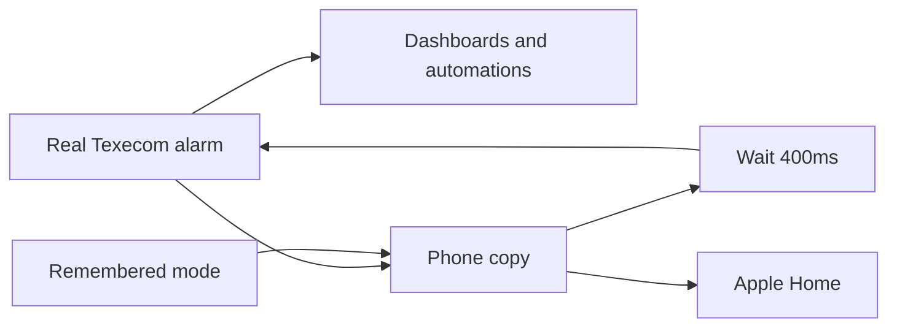

# How to show the alarm in Apple Home

The alarm this add-on creates is meant for Home Assistant. If you add **that**
entity to HomeKit, arming Night or Home from the iPhone often **jumps the
slider to Away** while the panel is still counting down.

That is not a bug in the add-on. Apple Home has no “arming” or “entry delay”
states. Home Assistant’s HomeKit Bridge treats `arming` as **Off, heading for
Away**.

The workaround is extra Home Assistant configuration — not a change to this
add-on, and not something to “fix” inside Apple Home. You create a **second**
alarm entity that the iPhone sees. That copy never reports arming or pending,
so the slider stays on Night, Home, or Away until the house is actually set or
unset.

Keep your dashboard cards and automations on the **real** Texecom alarm. Do
not put ready-to-arm, open-door, or guest rules in this copy — those stay on
the [ready-to-arm switches](use-ready-to-arm.md).

## What you will have

Two alarm entities:

| Use this for | Entity | Put in Apple Home? |
| --- | --- | --- |
| Dashboards and automations (the real panel) | `alarm_control_panel.texecom_alarm_arm_status` | **No** |
| The iPhone / Apple Home tile | `alarm_control_panel.texecom_alarm_homekit` | **Yes — this one only** |

Three helpers the phone copy uses (Home Assistant only):

| What it does | Entity |
| --- | --- |
| Remembers the mode you asked for (or the panel confirmed) | `input_select.texecom_alarm_homekit_hold` |
| Waits 400ms so a slider drag does not send three arm commands | `script.texecom_alarm_homekit_forward_arm` |
| Updates the memory when you arm from the keypad, or when an arm is blocked | automation `texecom_alarm_homekit_sync_hold` |

This add-on also fires `event.texecom_alarm_blocked_arm` (`event_type`: `away`,
`home`, or `night`) when a ready-to-arm switch refuses an arm. The automation
uses that so the iPhone tile does not stay stuck on a mode that never happened.



If you renamed the Texecom alarm entity, use your id everywhere this guide
says `alarm_control_panel.texecom_alarm_arm_status`.

## What you need

- The add-on running, with **Texecom Alarm** visible in Home Assistant (see
  [Documentation](../../texecom_alarm/DOCS.md)).
- Access to Home Assistant YAML (`configuration.yaml` or a
  [package](https://www.home-assistant.io/docs/configuration/packages/)). You
  can create the dropdown helper in the UI instead; the template alarm, script,
  automation, and HomeKit filter are most reliable as YAML.
- If you already have `input_select:`, `template:`, `script:`, `automation:`,
  or `homekit:` in YAML, **merge** these items under the existing keys. Do not
  paste a second copy of the same top-level key.

## 1. A dropdown that remembers the mode

This is how the phone tile “sticks” while the real alarm still says Arming.

Do **not** add `initial:`. Without it, Home Assistant restores the last value
after a reload — you need that if you reload while the panel is still in exit.

```yaml
input_select:
  texecom_alarm_homekit_hold:
    name: Alarm HomeKit hold
    icon: mdi:shield-lock
    options:
      - none
      - armed_away
      - armed_night
      - armed_home
```

## 2. The phone alarm (template)

This is a modern **template** alarm (`template:` with `state:`). Do not use the
old `alarm_control_panel:` platform. `unique_id: texecom_alarm_homekit` must be
**new** — do not reuse a leftover template unique id that still owns
`alarm_control_panel.texecom_alarm_arm_status`. Do not set `optimistic: true`;
`code_arm_required: false`.

Copy this block as written, including all three `arm_away` / `arm_night` /
`arm_home` handlers (so the iPhone offers Home, Night, and Away) and the
`disarm` order (stop the wait script **before** disarming, or a delayed arm
can fire after Off). Arm handlers only set the dropdown and start
`script.texecom_alarm_homekit_forward_arm` — they must not call `alarm_arm_*`
on the Texecom entity. Disarm runs `script.turn_off` on that script **first**,
then sets hold to `none`, then `alarm_disarm` on the Texecom entity.

```yaml
template:
  - alarm_control_panel:
      - unique_id: texecom_alarm_homekit
        default_entity_id: alarm_control_panel.texecom_alarm_homekit
        name: Alarm HomeKit
        code_arm_required: false
        state: >-
          
          
          
          
            {{ src }}
          
            {{ hold }}
          
            {{ this.state }}
          
            disarmed
          
            disarmed
          
        arm_away:
          - action: input_select.select_option
            target:
              entity_id: input_select.texecom_alarm_homekit_hold
            data:
              option: armed_away
          - action: script.texecom_alarm_homekit_forward_arm
        arm_night:
          - action: input_select.select_option
            target:
              entity_id: input_select.texecom_alarm_homekit_hold
            data:
              option: armed_night
          - action: script.texecom_alarm_homekit_forward_arm
        arm_home:
          - action: input_select.select_option
            target:
              entity_id: input_select.texecom_alarm_homekit_hold
            data:
              option: armed_home
          - action: script.texecom_alarm_homekit_forward_arm
        disarm:
          - action: script.turn_off
            target:
              entity_id: script.texecom_alarm_homekit_forward_arm
          - action: input_select.select_option
            target:
              entity_id: input_select.texecom_alarm_homekit_hold
            data:
              option: none
          - action: alarm_control_panel.alarm_disarm
            target:
              entity_id: alarm_control_panel.texecom_alarm_arm_status
```

The tile sticks because `state:` shows the remembered mode while the real
alarm is still `disarmed`, `arming`, or `pending`. `state:` must never return
`arming` or `pending`, and must not treat an empty hold as `armed_away`.

- When the real alarm is `armed_*`, `triggered`, `unavailable`, or `unknown`,
  pass that through (including `triggered` — do not hide an alarm).
- Else if hold is `armed_*`, show hold.
- Else if the real alarm is `arming` or `pending` and this entity was already
  `armed_*`, keep the current state (keypad arm before hold is set).
- Else `disarmed`.

## 3. Wait before talking to the panel

Dragging the Apple Home slider can send Night, then Away, then Home a few
hundred milliseconds apart. This script restarts on each write, waits 400ms,
and arms **only the last** mode in the dropdown.

```yaml
script:
  texecom_alarm_homekit_forward_arm:
    alias: Forward HomeKit alarm arm after debounce
    mode: restart
    sequence:
      - delay:
          milliseconds: 400
      - choose:
          - conditions:
              - condition: state
                entity_id: input_select.texecom_alarm_homekit_hold
                state: armed_away
            sequence:
              - action: alarm_control_panel.alarm_arm_away
                target:
                  entity_id: alarm_control_panel.texecom_alarm_arm_status
          - conditions:
              - condition: state
                entity_id: input_select.texecom_alarm_homekit_hold
                state: armed_night
            sequence:
              - action: alarm_control_panel.alarm_arm_night
                target:
                  entity_id: alarm_control_panel.texecom_alarm_arm_status
          - conditions:
              - condition: state
                entity_id: input_select.texecom_alarm_homekit_hold
                state: armed_home
            sequence:
              - action: alarm_control_panel.alarm_arm_home
                target:
                  entity_id: alarm_control_panel.texecom_alarm_arm_status
```

`mode: restart`, then a 400ms delay, then `alarm_arm_*` on
`alarm_control_panel.texecom_alarm_arm_status` from the **current** hold. Do
not omit the delay. Do not arm from the template handlers.

## 4. Keep the memory in sync with the real alarm

If you arm from the keypad, the dropdown should follow. If you disarm for
real, it should clear. If an arm is **blocked** (ready switch off), the real
alarm may flash Arming then go back to Off — that must **not** wipe a mode you
just chose unless the blocked-arm event is for that same mode.

```yaml
automation:
  - id: texecom_alarm_homekit_sync_hold
    alias: Sync HomeKit alarm hold from panel
    trigger:
      - platform: state
        entity_id: alarm_control_panel.texecom_alarm_arm_status
        to:
          - armed_away
          - armed_night
          - armed_home
        id: armed
      - platform: state
        entity_id: alarm_control_panel.texecom_alarm_arm_status
        from:
          - armed_away
          - armed_night
          - armed_home
          - pending
        to: disarmed
        id: disarmed
      - platform: state
        entity_id: event.texecom_alarm_blocked_arm
        id: blocked_arm
    action:
      - choose:
          - conditions:
              - condition: trigger
                id: armed
            sequence:
              - action: input_select.select_option
                target:
                  entity_id: input_select.texecom_alarm_homekit_hold
                data:
                  option: "{{ trigger.to_state.state }}"
          - conditions:
              - condition: trigger
                id: disarmed
            sequence:
              - action: input_select.select_option
                target:
                  entity_id: input_select.texecom_alarm_homekit_hold
                data:
                  option: none
          - conditions:
              - condition: trigger
                id: blocked_arm
              - condition: template
                value_template: >-
                  
                  
                  {{
                    (ev == 'night' and hold == 'armed_night')
                    or (ev == 'away' and hold == 'armed_away')
                    or (ev == 'home' and hold == 'armed_home')
                  }}
            sequence:
              - action: input_select.select_option
                target:
                  entity_id: input_select.texecom_alarm_homekit_hold
                data:
                  option: none
    mode: queued
    max: 10
```

On source `armed_*`, set hold to that state. On source `disarmed`, clear hold
**only** when `from` is `armed_away`, `armed_night`, `armed_home`, or
`pending` — do **not** include `arming` in `from` (a blocked arm is `arming`
then `disarmed`). On `event.texecom_alarm_blocked_arm`, clear hold only if it
still matches `event_type` (`night` → `armed_night`, `away` → `armed_away`,
`home` → `armed_home`). Do not write hold when the source is `triggered`.
`mode: queued`, `max: 10`.

## 5. Tell HomeKit about the phone copy only

Add a HomeKit **accessory** that includes **one** entity: the phone alarm.
Leave the real Texecom alarm out of every HomeKit include list.

```yaml
homekit:
  - name: "Texecom Alarm"
    port: 21064
    mode: accessory
    filter:
      include_entities:
        - alarm_control_panel.texecom_alarm_homekit
    entity_config:
      alarm_control_panel.texecom_alarm_homekit:
        name: Texecom Alarm
```

Use another port if `21064` is already taken. The `entity_config` name is the
label on the iPhone tile — change it if you like.

If you already have a HomeKit Bridge in the UI
(**Settings → Devices & services → HomeKit Bridge**), the same rule applies:
include `alarm_control_panel.texecom_alarm_homekit` only.

## Reload and pair

1. Reload the helpers you added (`input_select` often needs **Developer
   tools → YAML → Input selects**, or a Home Assistant restart). Reload
   template entities, scripts, and automations the same way.
2. Reload HomeKit after the include list changes.
3. In the Apple Home app, add the new accessory when Home Assistant shows the
   pairing code.
4. If you previously exposed the **real** Texecom alarm and the iPhone still
   shows the old tile, delete that accessory in Apple Home and add the new one
   once.

## Do not

- Put ready-to-arm, door/window, guest, or time-of-day logic in this YAML —
  use the [ready-to-arm switches](use-ready-to-arm.md).
- Skip the 400ms wait (a slider drag will fire several arms at the panel).
- Clear the dropdown on every `disarmed` (that wipes the memory during a
  blocked-arm flash).
- Map `arming` to `armed_away` (that is the Away jump).
- Hide `triggered`.
- Expose both alarm entities to HomeKit.

## Check it

Use the real Texecom alarm card in Home Assistant for Arming / entry delay.
Use the iPhone tile for the checks in the last column.

| Try this | Real alarm | iPhone / phone copy |
| --- | --- | --- |
| Arm Night | Shows Arming, then Night | Stays Night — must not jump to Away |
| Slide to Home and leave it | One Home arm after about 400ms | Stays Home |
| Sweep the slider Night → Home | Only the last mode is sent | Does not land on Away |
| Walk in (entry delay) | Pending, then Off | Stays Night / Home / Away until you really unset |
| Arm with that Ready switch off | Stays or returns to Off | Memory clears only for that same mode |
| Features | — | Home, Night, and Away offered; no arm code required |

Any automation that waits for entry delay (`pending`) must watch
`alarm_control_panel.texecom_alarm_arm_status`, not the phone copy.

## Related

- Ready-to-arm refuse: [How to refuse an arm that is not ready](use-ready-to-arm.md)
- Alarm entity and `arming` payloads: [MQTT reference](../reference/mqtt.md#alarm-control-panel)
- Option and entity overview: [Documentation](../../texecom_alarm/DOCS.md#what-appears-in-home-assistant)
