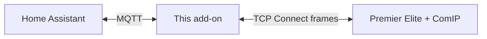
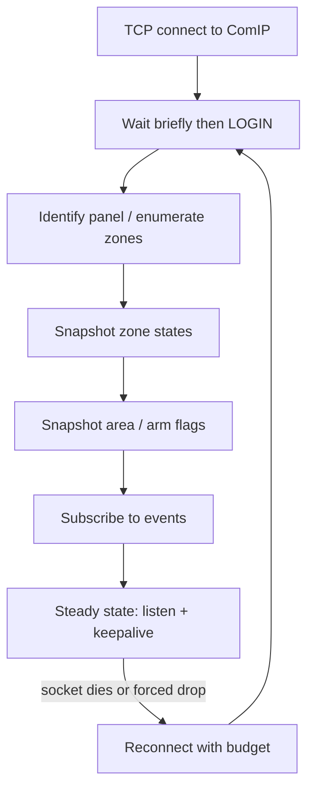
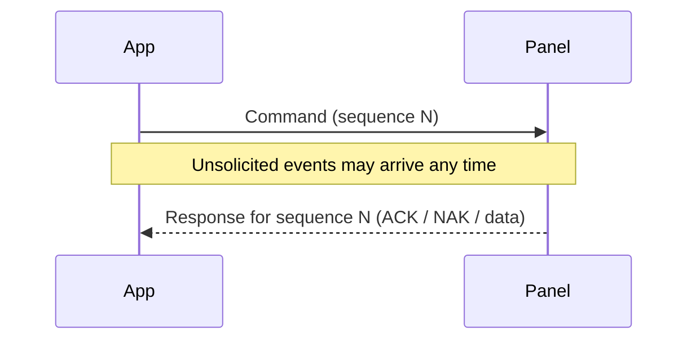
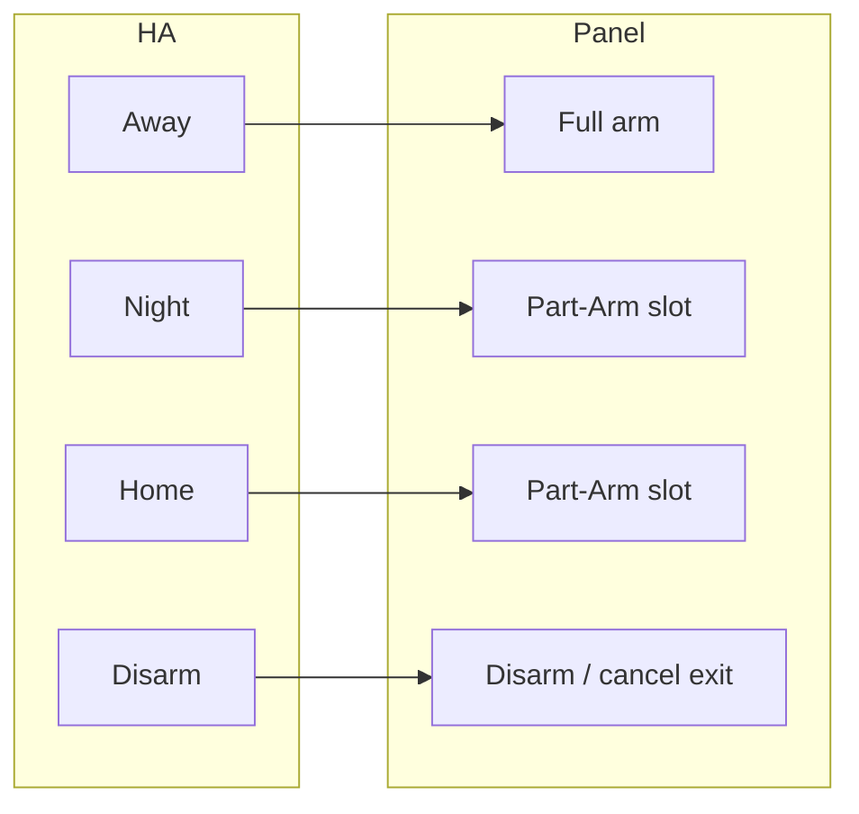
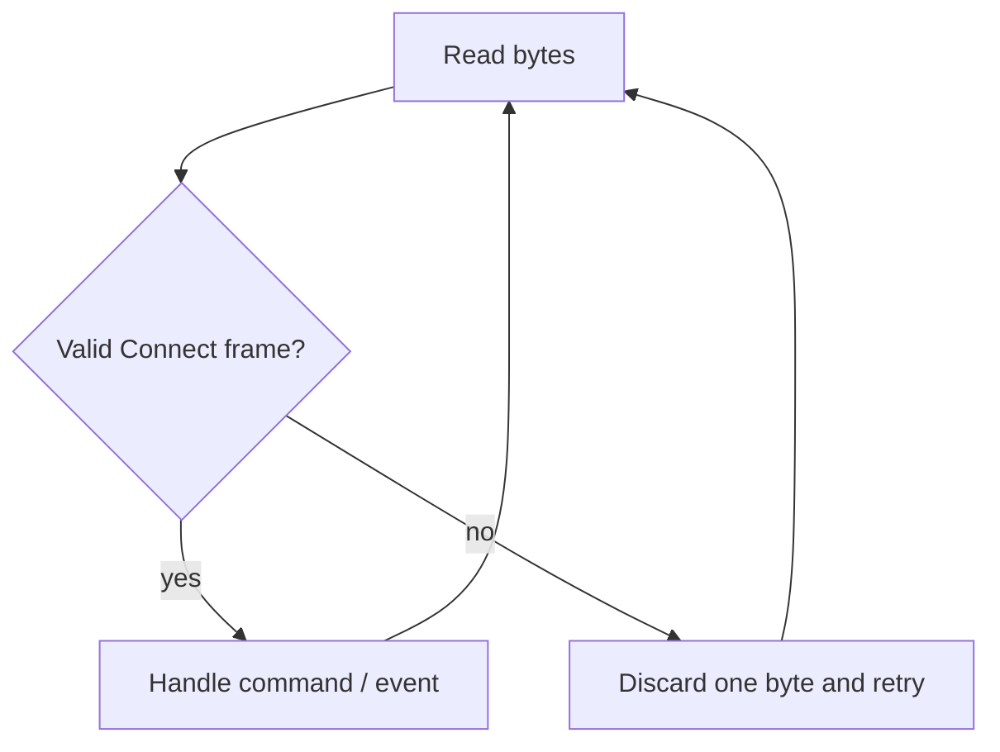
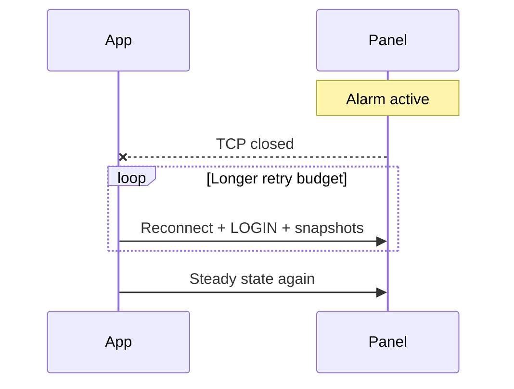

# Texecom Connect — protocol overview

> **Observational explanation — not an official Texecom specification.**  
> This page is the **human-facing** guide to how the Connect/ComIP dialogue works on our Premier Elite panel.  
> Byte-level tables live in the [protocol reference](protocol-reference.md).  
> Project position: [Legal stance](legal-stance.md).

**Audience:** practitioners and agents who need the *shape* of the protocol before diving into opcodes.  
**Panel in mind:** Elite 88 via ComIP (one TCP login at a time). Other models/firmware may differ.

---

## Mental model

Home Assistant talks to **MQTT**. This add-on holds a **single TCP session** to the panel’s network module, speaks **Texecom Connect** frames on that socket, and translates panel events into MQTT (and MQTT arm/disarm into panel commands).

Three ideas that unlock everything else:

1. **One shared socket** carries commands, replies, and unsolicited events — interleaved.
2. **Arm modes share one command**; Home/Night are Part-Arm slots configured per install (Away is full arm).
3. **The wire is noisy** around arm/disarm/trigger — clients must skip junk and sometimes reconnect patiently after a real alarm.

---

## Session lifecycle

A healthy client does not “just listen.” After TCP connect it logs in, learns the panel, takes **snapshots** so MQTT starts correct, subscribes to pushes, then keeps the session alive with a light read.

**Steady state:** unsolicited zone/area/log messages update live entities; roughly every tens of seconds an idle **keepalive** read stops the panel hanging up a quiet session (~1 minute without outbound traffic).

**Startup snapshots** matter: push-only would leave MQTT wrong until something moves. Details: [protocol reference](protocol-reference.md) (`GETZONESTATE`, `GETAREAFLAGS`).

---

## What a “message” is (without the hex)

Every Connect message is a small framed packet: start marker, type, length, sequence, payload, checksum.

| Type | Role |
|------|------|
| Command | App → panel (“arm”, “read datetime”, …) |
| Response | Panel → app (ACK, NAK, or data for that command) |
| Message | Panel → app unsolicited (zone opened, area armed, log line, …) |

If a response is late, retry **the same sequence**. Ordinary timing collisions are fine; what breaks naive clients is **non-Connect garbage** on the same TCP stream (see below).

---

## Arm, Part-Arm, and disarm

**Mechanism (general):** one arm command with a **mode byte**; one disarm command that does not care which mode you were in.

**Meaning (per install):** which mode byte is “Night” or “Home” depends on how the engineer programmed Part-Arm slots. This household’s mapping is configuration, not a universal law.

Typical **Away** story on the event path: exit delay → fully armed → later disarm → disarmed.  
**Night / Home** settle as part-armed (with slot-specific settled states).  
**Home disarm** on this firmware has been fussier on the *event* path (ACK still happens; a clean “disarmed” area push is not guaranteed) — clients may need a flags snapshot after reconnect. See the reference and recent live notes.

**After a real alarm:** whether a separate “reset area” command is required before disarm is still an open spike (SPIKE-009) — do not assume yet.

---

## Live updates (after subscribe)

Once subscribed, the panel pushes:

| Kind | Plain meaning |
|------|----------------|
| Zone | A sensor went open/active or secure/closed |
| Area | Arming state changed (exit, armed, alarm, …) |
| Log | Richer audit trail (often accompanies arm/disarm) |
| Output / User | Bookkeeping / keypad activity — useful context, not the main HA state |

Zone pushes are **sensor-class agnostic**: a door and a PIR look the same on the wire; friendly names and device classes come from enumeration, not from the live event shape.

---

## When the line misbehaves

### Junk on the wire (resync)

Around arm/disarm/trigger, ComIP can inject **modem/AT-style or other non-frame bytes** onto the same TCP session. Treating that as a fatal CRC error crashes the client.

**Required behaviour:** skip forward until the next valid Connect frame (ADR-002).

### Real trigger (forced disconnect)

A full alarm often **closes the TCP session**. Recovery can take tens of seconds (dialer traffic, module busy). Retry budgets should be **longer after trigger** than after a normal blip (ADR-002).

### Quiet death / zombies

The socket can still look “up” (keepalive OK) while arm commands NAK or pushes stall. Detecting that is a **product** concern (panel-link trust), not a different wire opcode — see ADR-010 / SPIKE-008 work.

---

## Hard rules of the road

- **One ComIP login at a time** — stop the other client before this add-on connects.
- **Keepalive** — do not run forever listen-only.
- **Resync, don’t panic** on unexpected bytes.
- **Don’t hardcode Home/Night slots** from one house’s capture — use install config (Away = full arm).
- **Don’t treat MQTT retain alone** as truth after restart — snapshot after login.

---

## Where to go next

| Need | Go here |
|------|---------|
| Opcodes, bodies, flag indices, LOG types | [Protocol reference](protocol-reference.md) |
| Why we reconnect the way we do | ADR-002 |
| Why Away ≠ Part-Arm | ADR-008 |
| Startup zone / area snapshots | ADR-006, ADR-009 |
| Evidence for a specific claim | Linked spike under `docs/spikes/` |
