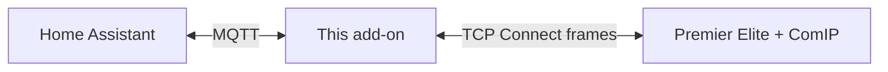
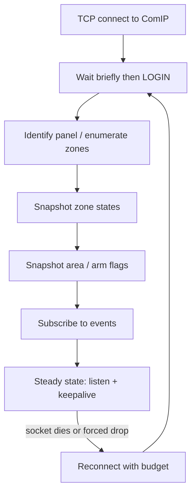
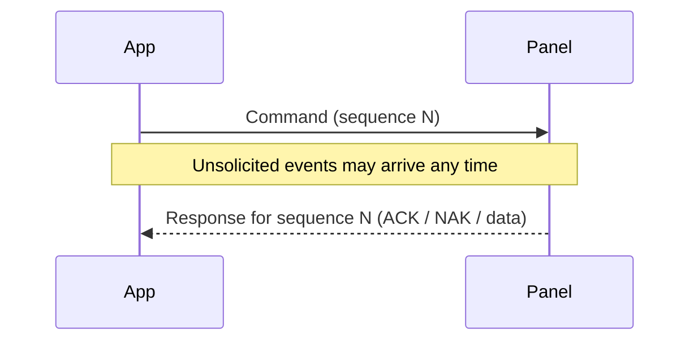
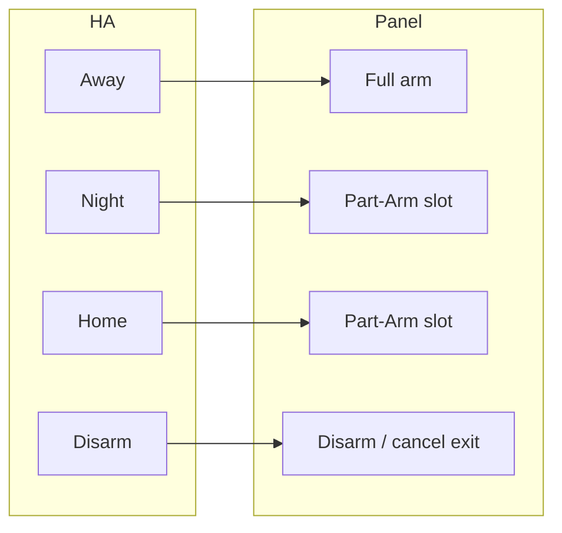
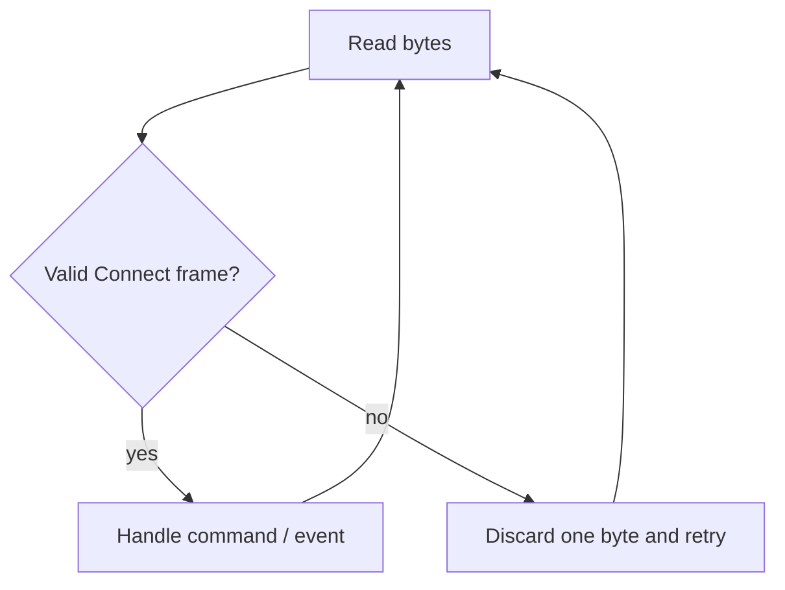

# Texecom Connect — protocol overview

> **Observational explanation — not an official Texecom specification.**  
> This page is the **human-facing** guide to how the Connect/ComIP dialogue works on a Premier Elite panel.  
> Byte-level tables live in the [protocol reference](protocol-reference.md).  
> Project position: [Legal stance](legal-stance.md).

**Audience:** operators and maintainers who need the *shape* of the protocol before diving into opcodes.  
**Panel in mind:** Premier Elite via a dedicated **ComIP** (one TCP login at a time on that module). Other models/firmware may differ. Captures that saw Hayes modem commands on the wire were on an installer **SmartCom** sharing alarm reporting, not a dedicated ComIP — see [When the line misbehaves](#when-the-line-misbehaves).

---

## Mental model

Home Assistant talks to **MQTT**. This add-on holds a **single TCP session** to the panel’s network module, speaks **Texecom Connect** frames on that socket, and translates panel events into MQTT (and MQTT arm/disarm into panel commands).



Three ideas that unlock everything else:

1. **One shared socket** carries commands, replies, and unsolicited events — interleaved.
2. **Arm modes share one command**; Home/Night are Part-Arm slots configured per install (Away is full arm).
3. **Skip unexpected bytes; reconnect if the socket dies** — do not crash. Hayes modem noise (`ATH0` / `ATZ`) is the installer **SmartCom** (or any module bound to alarm reporting) talking on the same serial port — not normal dedicated-ComIP behaviour.

---

## Session lifecycle

A healthy client does not “just listen.” After TCP connect it logs in, learns the panel, takes **snapshots** so MQTT starts correct, subscribes to pushes, then keeps the session alive with a light read.



**Steady state:** unsolicited zone/area/log messages update live entities; roughly every tens of seconds an idle **keepalive** read stops the panel hanging up a quiet session (~1 minute without outbound traffic).

**Startup snapshots** matter: push-only would leave MQTT wrong until something moves. Details: [protocol reference](protocol-reference.md) (`GETZONESTATE`, `GETAREAFLAGS`).

---

## What a “message” is (without the hex)

Every Connect message is a small framed packet: start marker, type, length, sequence, payload, checksum.

| Type | Role |
|------|------|
| Command | App → panel (“arm”, “read datetime”, …) |
| Response | Panel → app (ACK, NAK, or data for that command) |
| Message | Panel → app unsolicited (zone opened, area armed, log line, …) |



If a response is late, retry **the same sequence**. Ordinary timing collisions are fine. Treat unexpected bytes as skippable, not fatal — including Hayes modem text if Home Assistant is accidentally on the signalling module (see below).

---

## Arm, Part-Arm, and disarm

**Mechanism (general):** one arm command with a **mode byte**; one disarm command that does not care which mode you were in.

**Meaning (per install):** which mode byte is “Night” or “Home” depends on how the engineer programmed Part-Arm slots. That mapping is install-time configuration, not a protocol constant.



Typical **Away** story on the event path: exit delay → fully armed → later disarm → disarmed.  
**Night / Home** settle as part-armed (with slot-specific settled states).  
**Home disarm** on this firmware has been fussier on the *event* path (ACK still happens; a clean “disarmed” area push is not guaranteed) — clients may need a flags snapshot after reconnect. See the reference and recent live notes.

**After a real alarm on the dedicated ComIP:** Disarm from Home Assistant (the ordinary disarm command) stopped a live alarm while the monitoring station and the Texecom Connect app stayed up (SPIKE-010). SPIKE-009’s “HA Disarm did nothing” run was on the installer SmartCom, where the session had already been kicked off.

---

## Live updates (after subscribe)

Once subscribed, the panel pushes:

| Kind | Plain meaning |
|------|----------------|
| Zone | A sensor went open/active or secure/closed |
| Area | Arming state changed (exit, armed, alarm, …) |
| Log | Richer audit trail (often accompanies arm/disarm) |
| Output / User | Bookkeeping / keypad activity — useful context, not the main HA state |

Zone pushes are **sensor-class agnostic**: a door and a PIR look the same on the wire; friendly names and device classes come from enumeration, not from the live event shape.

---

## When the line misbehaves

### Junk on the wire (resync)

**Required behaviour:** skip forward until the next valid Connect frame rather than crashing (ADR-002, kept unconditionally by ADR-014). Garbage still happens — truncated frames, bad CRC lead-in, other clients colliding. Treating it as fatal is what used to kill naive clients.

**Hayes modem commands (`ATH0`, `ATZ`) are not normal ComIP traffic.** They were captured on an installer **SmartCom** whose job is alarm reporting / dialer work: it multiplexes AT commands onto the same TCP session around arm, disarm, and trigger. If you see that text on the Home Assistant session, you are almost certainly pointed at the signalling module, not the dedicated ComIP — see [Home Assistant loses the panel during an alarm](ha-loses-panel-during-alarm.md). On a dedicated ComIP used only for local control, live walks stayed Connect-clean through Home arm/disarm and through a real alarm plus HA Disarm.



### Real trigger (forced disconnect)

A full alarm **force-closing the Home Assistant TCP session** was measured on the **SmartCom** (SPIKE-002 / SPIKE-009): the panel seizes that module to report the alarm, kicks off the Connect login, and the line may then show dialer/modem traffic while reconnect fails. That is **not** established ComIP behaviour. On the dedicated ComIP (SPIKE-010 / ADR-013 / ADR-014) the session stayed up through a live alarm while the monitoring station was called and the Texecom Connect app stayed live; HA Disarm worked.

The add-on still retries longer after a trigger-adjacent drop (safety net if `panel_host` is the signalling module or reporting is bound to the ComIP port). Do not document that long wait as the expected path for a correctly pointed ComIP.

```mermaid
sequenceDiagram
  participant App
  participant Panel
  Note over Panel: Alarm active
  alt Session still up (dedicated ComIP, SPIKE-010)
    App->>Panel: Disarm
    Panel-->>App: ACK; session stays up
  else Session closed (shared signalling module)
    Panel--xApp: TCP closed
    loop Longer retry budget
      App->>Panel: Reconnect + LOGIN + snapshots
    end
  end
  App->>Panel: Steady state again
```

### Quiet death / zombies

The socket can still look “up” (keepalive OK) while arm commands NAK or pushes stall. Detecting that is a **product** concern (panel-link trust), not a different wire opcode — see ADR-010 / SPIKE-008 work.

---

## Hard rules of the road

- **One Connect login per network module** — stop the other client on that IP before this add-on connects. Two modules (ComIP + SmartCom) can each hold a login.
- **Panel host is the dedicated ComIP**, not the installer SmartCom (ADR-013). Modem/AT bytes on the HA session are a wrong-module tell, not “how ComIP works.”
- **Keepalive** — do not run forever listen-only.
- **Resync, don’t panic** on unexpected bytes (including SmartCom modem piping if someone mis-points `panel_host`).
- **Don’t hardcode Home/Night slots** from one install’s capture — use install config (Away = full arm).
- **Don’t treat MQTT retain alone** as truth after restart — snapshot after login.

---

## Where to go next

| Need | Go here |
|------|---------|
| Opcodes, bodies, flag indices, LOG types | [Protocol reference](protocol-reference.md) |
| Why we reconnect the way we do | ADR-014 (host-scoped; supersedes ADR-002’s universal trigger-drop claim); ADR-002 kept for resync-on-junk |
| Which module Home Assistant must use | ADR-013; [wrong-module how-to](ha-loses-panel-during-alarm.md) |
| Why Away ≠ Part-Arm | ADR-008 |
| Startup zone / area snapshots | ADR-006, ADR-009 |
| Evidence for a specific claim | Linked spike under `docs/spikes/` |
