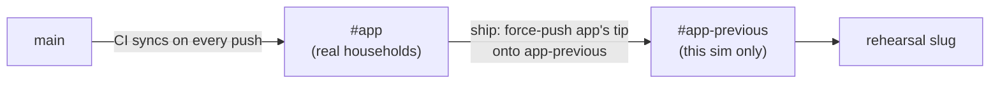

## How ports square (HA docs ↔ Cursor)

One Core process listens on **8123 inside the remote**. Two laptop doors open onto it:

| Path | Laptop URL | Mechanism | Role |
|------|------------|-----------|------|
| **Official (HA docs)** | [http://localhost:7123/](http://localhost:7123/) | Docker `appPort: ["7123:8123"]` — stock template | Prefer this |
| **Cursor Ports** | [http://localhost:8123/](http://localhost:8123/) | IDE `forwardPorts: [8123]` | Same Core when 7123 isn’t published |

They are not competing schemes. **7123** remaps via Docker; **8123** is a same-number IDE tunnel. Both hit the same UI.

**Critical:** never let Cursor **Auto Forward 7123**. That tunnels laptop `:7123` → remote `:7123` (nothing listens) and steals the official URL from Docker’s `7123→8123` publish. `.devcontainer.json` sets `onAutoForward: "ignore"` for **7123** and **80**. If a ghost **7123** row appears anyway, stop-forward it.

**Do not forward or open port 80.** Supervisor beta defaults Core to `:80` and turns `:8123` into a redirect to bare `http://localhost/`, which loops under Cursor. `ha-cold-start.sh` pins `http.server_port` to **8123** so stock `7123:8123` stays valid.

After rebuild + cold-start, Ports should show **8123** (Home Assistant) and **4357** (Observer). Open **7123** in a normal browser (Docker publish) or **8123** via the Ports globe.

Sanity check inside the remote: `curl -sI http://127.0.0.1:8123/` → relative `location: /…` or 200 — never `Location: http://localhost/`.

## Catalogue layout (dual-bind)

This repo is Supervisor **catalogue**-shaped: root `repository.yaml`, App in
`texecom_alarm/`. Development and CI stay on `main`. Household store installs
use the generated `#app` branch (`https://github.com/michaelmarconi/texecom_alarm#app`),
which CI syncs from allowlisted catalogue paths only. The apps devcontainer
mounts the git root at `/workspaces/texecom_alarm` and binds `texecom_alarm/`
to `/mnt/supervisor/apps/local/texecom_alarm` so Supervisor still sees
`local_texecom_alarm`. Cold-start and other scripts still run from the **repo
root** (`./scripts/…`).

The source `texecom_alarm/config.yaml` on `main` has no `image:` key, so
`local_texecom_alarm` stays buildable from the local Dockerfile. The `#app`
branch sync (`scripts/build-app-branch-tree.sh`) injects `image:
ghcr.io/michaelmarconi/texecom-alarm` into the copy it publishes, so the
store install (`…#app`, e.g. slug `ebb3b885_texecom_alarm`) pulls the
prebuilt GHCR image instead. Same source, two installs, two different
`config.yaml`s on disk — see "Refresh local add-on" below if rebuild ever
breaks.

## Cold start (deterministic)

From the repo root in the apps devcontainer:

```bash
./scripts/ha-cold-start.sh
```

Same as VS Code / Cursor task **Start Home Assistant** (wired to this script).

What it does:

1. Bring up Supervisor/Core if needed; pin `http.server_port` to **8123**.
2. Ensure **Mosquitto** (`core_mosquitto`) is installed, has the local-sim MQTT login, and is started.
3. Ensure **Texecom Alarm** (`local_texecom_alarm`) is installed, then **always rebuild it from current source** (`ha apps rebuild`) before touching options/start — cold-start never shows you a stale cached build. If `panel_host` is empty, apply sim defaults from `TEXECOM_*` (or the script's local placeholders): Part-Arm Night/Home/Unused, MQTT → `core-mosquitto`; start it.
4. Print UI URLs. Prefer **`http://localhost:7123/`**; if that fails, use **`http://localhost:8123/`**.

The rebuild in step 3 only ever targets `local_texecom_alarm` (the bind-mounted dev copy). It never touches the store-installed GHCR copy (e.g. `ebb3b885_texecom_alarm`) — that one must stay exactly as a real household Update would leave it, for `/ship` update-rehearsal testing (see "Household Update rehearsal" below).

Idempotent: re-run is safe (no DB/registry wipe). Override panel/MQTT via `TEXECOM_PANEL_HOST`, `TEXECOM_UDL_PASSWORD`, `TEXECOM_MQTT_*`, `TEXECOM_PART_ARM_{1,2,3}`.

Does **not** complete HA onboarding for you. Panel must be free (ADR-001 single ComIP connection) or Texecom may enter `error`.


## Entity reset (no duplicate / suffixed MQTT IDs)

When discovery left orphans or `_2` entity IDs, wipe registries + MQTT retain **without** full re-onboarding:

```bash
./scripts/ha-entity-reset.sh --yes
```

(`--yes` is required so a mistype cannot wipe the sim.)

What it does:

1. Stop Texecom Alarm.
2. Clear retained `homeassistant/#` + `texecom/#` (if Mosquitto is up); delete `mosquitto.db`.
3. Stop Core; delete `home-assistant_v2.db*` + entity/device/area registries + restore_state.
4. Start Mosquitto (if installed) + Core; **leave Texecom stopped**.
5. Keep auth, onboarding, `config_entries`, Mosquitto `options.json`.

Then hard-refresh `http://localhost:8123/`, start Texecom when you want a clean rediscovery.

**Expected leftovers:** Supervisor add-on metrics (`binary_sensor.texecom_alarm_running`, etc.) — not MQTT zone entities. Prefixed zones like `binary_sensor.texecom_alarm_front_door_1` after a **fresh** start are normal panel inventory (`_1` = zone number), not wipe dirt.

## Disk space (Supervisor ≥2 GiB gate)

Supervisor refuses install / rebuild / update under **2 GiB** free. Cold-start enforces the same when it must start/pull.

```bash
ha host info | grep disk_
df -h /mnt/supervisor
```

This apps devcontainer shares a **Docker Desktop VM disk**. Reclaim stale host volumes when low — see historical reclaim recipe in git history / ask — do **not** delete Supervisor/anonymous volumes used by this stack.

## Refresh local add-on (without a version bump)

Cold-start (above) already rebuilds `local_texecom_alarm` from current source every
run, so a fresh `./scripts/ha-cold-start.sh` is usually enough. Use the manual
sequence below when you've changed code **after** cold-start already ran this
session and don't want to re-run the whole script.

**Do not bump `config.yaml` `version` to force a UI refresh.** Policy: [addon-versioning.md](addon-versioning.md).

```bash
ha store reload
ha apps info local_texecom_alarm | grep -E '^(version|version_latest):'
# same version → rebuild; mismatched installed vs disk → update
ha apps rebuild local_texecom_alarm
# or: ha apps update local_texecom_alarm
```

`ha apps rebuild` only works while `texecom_alarm/config.yaml` on `main` has
**no** `image:` key — presence of `image:` makes Supervisor treat an install
as pull-only, even a `repository: local` bind mount. The GHCR `image:` line
is injected only into the published `#app` branch, by
`scripts/build-app-branch-tree.sh` (see Catalogue layout above). If
`ha apps rebuild local_texecom_alarm` ever fails with "it is image-based",
check that no one re-added `image:` to the source `config.yaml`, then
`ha store reload` — if that alone doesn't clear the cached flag, uninstall
and reinstall `local_texecom_alarm` (options aren't preserved across
uninstall, so capture `ha apps info local_texecom_alarm --raw-json | jq
.data.options` first).

After rebuild, Configuration Part-Arm radios should show **Home / Night / Unused**
only (Away excluded — ADR-008). If an older options file still has Away on a
slot, the app coerces that slot to Unused at load and logs a warning; Away
continues to arm via full-arm mode byte `0`.

**Stale option keys survive a rebuild.** Rebuilding only refreshes the schema/code —
it does not strip keys an install already had set that a newer `config.yaml` no
longer declares (e.g. a setting an ADR removed). Supervisor keeps them in the
add-on's persisted options untouched. `ha` has no CLI for editing options directly;
POST the full replacement object to the Supervisor API instead (see
`supervisor_set_options()` in `scripts/ha-cold-start.sh` for the exact call). Check
current state with `ha apps info local_texecom_alarm --raw-json | jq .data.options`
and compare against `texecom_alarm/config.yaml`'s `options:` block.

## Household Update rehearsal (not local rebuild)

What a real HA OS host does on a version bump is Supervisor **Update** on the
**store** slug (`…/texecom_alarm#app` + GHCR `image:` pull) — not
`ha apps rebuild local_texecom_alarm`. Local rebuild refreshes the bind-mount
dev copy; it does not exercise missing GHCR tags, stale `#app`, or options
persistence across a store Update.

**Home Assistant has no add-on downgrade or version pin** — no UI, no CLI flag;
the only supported rollback is a backup restore. So rehearsing a real FROM→TO
Update needs a git ref we can legitimately control. This repo keeps a second,
permanent branch, **`#app-previous`**, deliberately held one release behind
`#app`, purely for rehearsal — it is never the branch real households point at.



Before `/ship` Accept, rehearse that path in this sim HA:

```bash
./scripts/ha-store-upgrade-smoke.sh
# optional: --no-restart-local
```

The script stops `local_texecom_alarm`, confirms the rehearsal slug (sourced
from `#app-previous`) is sitting at the prior version, seeds it with the
household's real panel/MQTT credentials (under a distinct topic prefix so it
can't collide with `local_texecom_alarm`'s own MQTT discovery), confirms it
actually logs into the real panel before touching anything, force-pushes
`#app`'s current tip onto `#app-previous`, reloads, runs the real Update, and
asserts options survived **and** it still logs in and publishes discovery
afterwards — a functional proof the published artifact works, not just that
version/options fields moved. It then stops the store copy and rebuilds +
restarts `local_texecom_alarm`, which reclaims MQTT discovery back from the
rehearsal slug. The branch is left at the new version — self-sustaining for
next time. **Do not** run the store-installed copy and `local_*` together
(single ComIP + MQTT discovery clash — the script already sequences this for
you). Details: Ship skill "This repository" overlay; checklist row in
[ship.md](ship.md).

Do not repoint a repository's `origin` to fake an old version as a shortcut —
Supervisor now actively corrects `origin` back to its stored canonical URL the
moment it notices a mismatch, silently defeating that trick. Use
`#app-previous` instead.

## Down

1. Stop `supervisor_run` (Ctrl+C in its terminal, or kill the pid recorded by cold-start).
2. Remove Supervisor-managed containers:

```bash
docker rm -f hassio_supervisor homeassistant hassio_cli hassio_dns hassio_audio hassio_multicast hassio_observer 2>/dev/null
```

Confirm: `http://localhost:7123/` should not respond.
